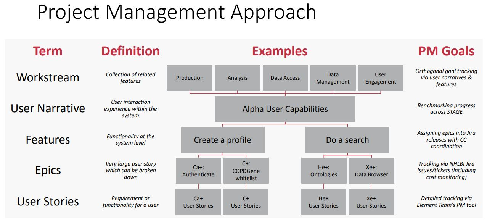

# Strategic Planning

In the context of agile development and a Consortium with a diverse set of members, the application of various agile-development terms may mean different things to different individuals.

The table below defines the BDC Core Terminology:

| **Term**       | **Definition/Description**                                                                                                                                                                                                                                              | **Example**                                                                                                                                                           |
| -------------- | ----------------------------------------------------------------------------------------------------------------------------------------------------------------------------------------------------------------------------------------------------------------------- | --------------------------------------------------------------------------------------------------------------------------------------------------------------------- |
| User Narrative | Descriptions of a user interaction experience within the system from the perspective of a particular persona. User Narratives are further broken down into Features, Epics, and User Stories.  Currently formulated into rough 6-month timelines to benchmark progress. | An experience bioinformatician wants to search TOPMed studies for a qualitative trait to be used in a GWAS study                                                      |
| Feature        | 
A functionality at the system level that fulfills a meaningful stakeholder need

*Level at which the BDC3 coordinates
                                                                                                                                       | Search TOPMed datasets using PIC-SURE platform                                                                                                                        |
| Epic           | 
A very large user story which can be broken down into executable stories

*NHLBI’s cost-monitoring level
                                                                                                                                                    | PIC-SURE is accessible on BDC                                                                                                                                         |
| User Stories   | 
A backlog item that describes a requirement or functionality for a user

*Finest level of PM Monitoring 
                                                                                                                                                    | A user can access PIC-SURE through an icon on BDC to initiate search                                                                                                  |
| Workstream     | A collection of related features; orthogonal to a User Narrative                                                                                                                                                                                                        | 
Workstreams impacted by the User Narrative above include:
<ul><li>production system</li><li>data analysis</li><li>data access</li><li>data management</li></ul> |


Project Management Approach PDF


### Strategic Planning Documents Reviewed & Approved by NHLBI Leadership









