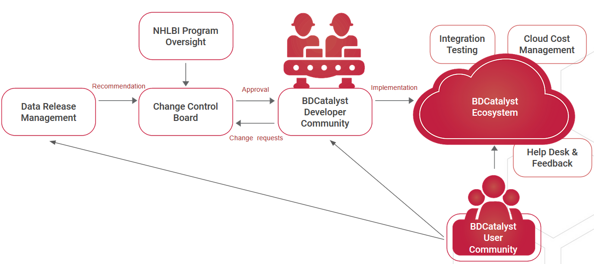

# Data Management Strategy

## **INTRODUCTION**

### Purpose of the Data Management Strategy

The NHLBI BioData Catalyst Data Management Strategy describes the approach taken by the NHLBI BioData Catalyst Consortium to manage data that the NHLBI BioData Catalyst Ecosystem is expected to acquire or otherwise interact with. A component of the NHLBI BioData Catalyst mission is to provide FAIR data to the NHLBI research community ([for additional information see the NHLBI BioData Catalyst Strategic Framework](https://www.biodatacatalyst.org/assets/StrategicPlanning/DataSTAGE-Strategic-Framework-Plan-V1-v2.0.pdf)). Through the creation of this Data Management Strategy, the Consortium establishes the data management roles and responsibilities, governance framework and data functions that will inform how the data will be managed within the bounds of the NHLBI BioData Catalyst Ecosystem.

Data management for the NHLBI BioData Catalyst Ecosystem will continue to evolve to address new challenges as the Ecosystem matures. As such, this document will be a living document and provide current practices, with the goal of standardizing and conforming to best practices in data management.

**1.2 Audience**

The Data Management Strategy is one component of the overall Data Management Plan, comprised of the documents in Table 1. The Data Management Strategy communicates to NHLBI BioData Catalyst stakeholders the overall strategy by which the consortium has agreed to manage the data. Additional detailed information around the processes by which data is managed in NHLBI BioData Catalyst are further described in the other complementary documents.

**Table 1**. NHLBI BioData Catalyst Data Management Documents

| **Document**                    | **Audience**                                                                                    | **Scope**                                                    | **Description**                                                                                                                          |
| ------------------------------- | ----------------------------------------------------------------------------------------------- | ------------------------------------------------------------ | ---------------------------------------------------------------------------------------------------------------------------------------- |
| Data Management Strategy        | External & Internal: (Research Community, Program Directors, NHLBI BioData Catalyst Consortium) | Strategy document for Data Management                        | High-level introduction to purpose and key concepts; description of key principles; governance strategy                                  |
| Data Release Management Process | Internal (NHLBI BioData Catalyst Consortium; development teams)                                 | Retrospective process documentation on TOPMed data ingestion | TOPMed Freeze 5b data ingestion process as the baseline                                                                                  |
| Data Generator Guidance         | External (Future data generators; PIs; study data owners)                                       | Guidance document for future data ingestion                  | Principles and expectations of data before ingest into the BDC system as determined by the Data Release Management Working Group (DRMWG) |

## **2 OVERVIEW**

The NHLBI BioData Catalyst is an instance of an NIH Data Commons Ecosystem, where Heart, Lung, Blood, and Sleep (HLBS) researchers can go to find, search, access, share, store, and compute on large scale data sets. The NHLBI BioData Catalyst Ecosystem serves as a novel, fully-functioning resource where users from a variety of disciplines and levels can perform complex operations and access newly-available scientific data to make significant strides in research and beyond.

The goal of data governance, separate from data management, is the definition and assignment of ownership, accountability and roles, and to identify the strategy by which NHLBI BioData Catalyst will create procedures, systems, and assurance for those processes necessary to assure data integrity, consistency and optimization of access and management.

For the purposes of this document we identify activities broadly into the following categories:

* **Identify**: Data to come into the system and then apply processes to represent the hosted data files in metadata.
* **Store & Secure**: As a cross-cloud architecture, NHLBI BioData Catalyst must manage storage buckets in AWS and GCP, make decisions on how the data is reflected across buckets, and ensure security of the data in architecture.
* **Provision:** To fulfill the mission of the NHLBI BioData Catalyst we must prepare data in a way that enables sharing within the Ecosystem as well as with other research data commons.
* **Expose:** Disparate data and data types coming into NHLBI BioData Catalyst will be presented for use by the research community in a variety of presentations depending on the research use case.
* **Govern**: NHLBI BioData Catalyst must create and manage a process to ensure necessary rigor over the data content, through policies and rules, as changes occur to the technology, processing and methodology.

.png>)

### **2.1 Key Terms and Concepts**

**Application Programming Interface (API):** a set of functions and procedures that allow the creation of applications which access the features or data of an operating system, application, or other services

**Audit**: process of systematic examination of the system determined by the quality assurance process

**AWS:** Amazon Web Services

**BDC3:** NHLBI BioData Catalyst Coordinating Center

**CCB:** Change Control Board

**Cloud:** storing and accessing data and programs in remote servers hosted on the Internet instead of on local computing systems. NHLBI BioData Catalyst duplicates data across the Amazon Web Services and Google Cloud Platform for data storage.

**Data**: includes all digitized information, data resources, derived data products, and results of digital extract from one store, transformation and/or load of this digital information within the NHLBI BioData Catalyst Ecosystem or a NHLBI BioData Catalyst platform.

**Data Index:** A data index is a unique identifier, created to allow future discovery of the information and/or metadata. For NHLBI BioData Catalyst, the Global Unique Identifiers (GUIDs) created at ingest for each object file serves as this unique identifier, added to the manifest file for all data files ingested.

**Data Ingestion**: the process of obtaining and importing data for availability across the NHLBI BioData Catalyst Ecosystem. Data can be streamed in real time or ingested in batches. _For data contributions for individual use see Data Upload_.

**Data Commons:** is a digital platform managed through the same policies and practices, designed to enable storage, access, use, and sharing of high value NIH datasets in a cloud environment to accelerate discoveries, providing tools, applications, and workflows to enable these capabilities in secure workspaces.

**Data Curation:** the organization and integration of data from various sources including the processes defined for the receipt, transfer, accounting, safeguarding, and destruction of material within the purview of the Ecosystem.

**Data Custodian**: All personnel who have operational responsibility for the data, especially NHLBI BioData Catalyst stakeholders. A collection of data may have multiple data custodians.

**Data Governance:** an organizational strategy to support business goals.

**Data Management:** describes how data as an asset is operationalized and used to support an organizational strategy.

**Data Manifest:** A manifest lists the contents and often location of items. Within NHLBI BioData Catalyst, the data manifest is a file containing data about the files ingested (md5, file size) as well as Access Control Lists, file name(s) and the URL for the deposition bucket.

**Data Owner**: An individual who is accountable for the data in a legal or business sense. The data owner is the executive or senior staff member who (1) answers for the proper care of the data by all within the organization who have access to or control of the data and (2) makes decisions about the dataset, system, or resource.

**Data Steward**: An individual or group who is responsible for the contents or values of the data, especially quality control and assurance. Data stewards may define business rules that apply to the data under their supervision.

**Data Upload:** Moving data from outside the NHLBI BioData Catalyst security boundary into a user accessible working location within the security boundary, i.e. [Bring Your Own Data](https://biodatacatalyst.nhlbi.nih.gov/resources/byod/) (BYOD)

**DAWG**: Data Access Working Group

**DCF:** Data Commons Framework

**DCFS:** Data Commons Framework Service

**DevOps**: set of practices that combines software development (Dev) and information-technology operations (Ops) which aims to shorten the systems development life cycle and provide continuous delivery with high software quality

**DHWG:** Data Harmonization Working Group

**DRMWG:** Data Release Management Working Group

**Ecosystem:** consisting of multiple cloud-based environments of tools, platforms, applications, data and workflows comprising NHLBI BioData Catalyst, enabling research investigators to find, access, share, store, and compute on large scale datasets in a secure workspace.

**Element Team DevOps**: Individual Other Transaction Awards (OTAs) led by a Principal Investigator (PI), or PIs, who will complete milestones and produce deliverables.

**FAIR Principles:** a set of guiding principles, including the creation of metadata, to make data **F**indable, **A**ccessible, **I**nteroperable and **R**e-usable [(Wilkinson et al. 2016)](https://www.nature.com/articles/sdata201618).

**Key Performance Indicator:** a quantifiable measure used to evaluate the success in meeting objectives for performance

**GCP**: Google Cloud Platform

**Metadata:** data about data which describes the properties of a dataset and is critical to supporting discoverability (the ‘F’ in FAIR - Findable).

**NHLBI**: National Heart, Lung, and Blood Institute

**OTA:** Other Transaction Awards

**PL**: Program Leadership

**Platform:** a data commons serving user accessible applications and application programming interface comprising the NHLBI BioData Catalyst Ecosystem. Examples: Terra, Gen3, Seven Bridges, etc.

**Quality Assurance:** the maintenance of a desired level of quality in a service or product, especially by means of attention to every stage of the process of delivery or production

**Quality Control:** a system of maintaining standards by testing a sample of the output against the specification

**STRIDES Initiative**: NIH **S**cience and **T**echnology **R**esearch **I**nfrastructure for **D**iscovery, **E**xperimentation, and **S**ustainability (STRIDES) Initiative allows NIH to explore the use of cloud environments to streamline NIH data use by partnering with commercial providers ([https://datascience.nih.gov/strides](https://datascience.nih.gov/strides))

### **2.3 Program Organization**

The NHLBI BioData Catalyst Ecosystem utilizes Amazon Web Services (AWS) and Google Cloud Platform (GCP) for data storage and computation. NHLBI BioData Catalyst is an ecosystem composed of several platforms (i.e., data commons). The Gen3 platform, hosted and operated by the University of Chicago, provides the gold master data reference, as well as authorization/authentication and indexing services; as such, they are responsible for the initial data ingestion and associated curation of data into the Ecosystem. Gen3 enables interoperability with other secure workspaces.

The PIC-SURE platform, hosted and operated by Harvard Medical School, enables access to clinical and genomic data via a User Interface and API to Investigators. Workspaces are provided by NHLBI BioData Catalyst Powered by Terra, hosted and operated by the Broad Institute; and NHLBI BioData Catalyst Powered by Seven Bridges, hosted and operated by Seven Bridges. Tools are provided in Dockstore/UCSC and Helx/RENCI with the coordinating center driven by RENCI/RTI.

###

### **2.4 NHLBI BioData Catalyst Role**

NHLBI BioData Catalyst acts as a **custodian of data** produced or resulting from studies, cataloged and indexed as part of ingestion, and provided for use within one of many platforms in the Ecosystem for exploration and analysis. NHLBI BioData Catalyst is responsible for providing secure access to data within the Ecosystem for discoverability and reuse, and to maximize scientific utility by enabling users to upload additional datasets for private analysis (i.e., data and analysis not intended to be shared back to the Ecosystem). As such, NHLBI BioData Catalyst is aligned with the NIST model of custodian management of data, which provides additional information on the roles of data owner, steward and custodianship [https://nvd.nist.gov/800-53](https://nvd.nist.gov/800-53), inheriting privacy and consent, as well as other data access controls and requirements from source systems.

Within the role as a **data custodian** the NHLBI BioData Catalyst Consortium provides controls which may take the form of policy, process or technology in four main areas:

1. data ingestion and indexing;
2. data standards and quality metrics;
3. data lifecycle management and process definition; and
4. community outreach and training.

The details describing these controls as applied to each data release will be found in the Data Release Management Plan.

## **3. DATA MANAGEMENT APPROACH**

### 3.1 Organizational Framework

This section details the organization and controls for the data management strategy, and will reference the charters for the Change Control Board (CCB) and Data Release Management Working Group (DRMWG) to define the roles performed, meeting frequency, and scope of their efforts.

####

.jpeg>)

####

#### **The NHLBI BioData Catalyst Program Leads:**

The NHLBI Program Leads will provide oversight and approval for decisions, and direct the Change Control Board, receiving information from the working groups.

#### **The NHLBI BioData Catalyst Change Control Board (CCB):**

The scope of the CCB is to make recommendations to the NHLBI Program Leads for proposed changes to the NHLBI BioData Catalyst Ecosystem which includes data, software or applications which impacts more than a single team within the Ecosystem or the scope, schedule, or budget of a single team.

[**Change Control Board Charter**](https://docs.google.com/document/d/18Xx-901QVo5dy4o_ruAH2F1UxXRbPOtH9sVl51fgCNw/edit)

#### **Data Release Management Working Group (DRMWG):**

The scope of the DRMWG is to identify, outline, and make recommendations around:

1\) Prioritization of data sets for release

2\) Formatting and organization of object files and their directory structure(s) for planned ingested datasets

3\) Data ingestion and release-specific metadata, in conjunction with the [Data Harmonization WG](https://docs.google.com/document/d/1J37W0EJUq12wBnYy0-dda22YkluV8fAoJxI3v6x4Tv4/edit)

4\) Data ingestion proposals and desired release timelines

5\) Other relevant obstacles related to data ingestion and use within the NHLBI BioData Catalyst system.

6\) Collaborate with [Data Access Working Group](https://docs.google.com/document/d/18FLKwWOMrhuWdkyIuaNYtA-wNBkF0axqFxru6xjMbus/edit#heading=h.dw5o8ig000r4) as needed

Identified issues and recommendations will be shared with other NHLBI BioData Catalyst working groups, teams, stakeholders and Change Control Board, as appropriate. This group will initially focus on identifying considerations for onboarding new data to support the NHLBI BioData Catalyst Fellows (April - June 2020), as well as onboarding NHLBI-identified datasets (TOPMed, BioLINCC, and CureSC (April - November 2020).

[**DRMWG Charter**](https://docs.google.com/document/d/1u4JpiIUg85_QicbEUIjQwBiOEsau_9qxr_bx8rTo5SM/edit)

### 3.3 Roles and Responsibilities

The following Responsible, Accountable, Consulted and Informed (RACI) chart has been developed for the NHLBI BioData Catalyst Ecosystem to define the roles and responsibilities for users and custodians of the Ecosystem.

#### **RACI Chart for Data Management Framework**

| Operational Function                                                                                                                                                                                                                                                                                                                                  | PL  | SC | CCB | 
DRM

WG
 | 
DH

WG
 | DA WG | BDC3 | Element Team DevOps Staff |
| ----------------------------------------------------------------------------------------------------------------------------------------------------------------------------------------------------------------------------------------------------------------------------------------------------------------------------------------------------- | --- | -- | --- | ------------------- | ------------------ | ----- | ---- | ------------------------- |
| **Identify**                                                                                                                                                                                                                                                                                                                                          |     |    |     |                     |                    |       |      |                           |
| Prioritize ingestion                                                                                                                                                                                                                                                                                                                                  | A   | C  | C   | R                   | I                  | I     | I    | I                         |
| Provide a central index service for all data                                                                                                                                                                                                                                                                                                          | A   | I  | C   | C                   | C                  | C     | I    | R                         |
| Determine data file metadata to identify data assets in the index                                                                                                                                                                                                                                                                                     | C   | C  | C   | R/A                 | C                  | C     | C    | I                         |
| Capture and expose provenance information                                                                                                                                                                                                                                                                                                             | I   | I  | C   | A                   | R                  | I     | I    | R                         |
| **Store & Secure**                                                                                                                                                                                                                                                                                                                                    |     |    |     |                     |                    |       |      |                           |
| Plan and manage data storage buckets                                                                                                                                                                                                                                                                                                                  | R/A | I  | C   | C                   | I                  | I     | I    | C                         |
| Manage platform cloud environments                                                                                                                                                                                                                                                                                                                    | A   | I  | C   | I                   | I                  | I     | I    | R                         |
| Ensure FISMA/FedRAMP compliance                                                                                                                                                                                                                                                                                                                       | A   | I  | C   | I                   | I                  | I     | C    | R                         |
| Report Privacy Concerns and Breaches                                                                                                                                                                                                                                                                                                                  | A   | I  | I   | C                   | I                  | I     | R    | R                         |
| Ensure compliance with consents                                                                                                                                                                                                                                                                                                                       | A   | I  | I   | C                   | I                  | R     | I    | R                         |
| Define quality control procedures at each stage of data transfer                                                                                                                                                                                                                                                                                      | I   | I  | C   | A                   | R                  | R     | R    | R                         |
| Run quality control procedures at each stage of data transfer                                                                                                                                                                                                                                                                                         | A   | I  | C   | C                   | I                  | I     | I    | R                         |
| Make data available through common identity and access management                                                                                                                                                                                                                                                                                     | A   | C  | C   | C                   | I                  | R     | I    | R                         |
| **Provision**                                                                                                                                                                                                                                                                                                                                         |     |    |     |                     |                    |       |      |                           |
| Utilize GA4GH and other standards-based interfaces for user’s query and interop with other data commons platforms                                                                                                                                                                                                                                     | A   | C  | C   | C                   | C                  | R     | I    | R                         |
| Evaluate emerging standards (e.g., PFB, PIC-SURE, FHIR, etc.) to enable data provisioning within the ecosystem                                                                                                                                                                                                                                        | A   | C  | C   | R                   | C                  | C     | I    | I                         |
| Craft an Ecosystem-wide search strategy                                                                                                                                                                                                                                                                                                               | A   | R  | C   | C                   | C                  | C     | C    | I                         |
| **Expose**                                                                                                                                                                                                                                                                                                                                            |     |    |     |                     |                    |       |      |                           |
| Enable consistent return of results for user search of data                                                                                                                                                                                                                                                                                           | A   | I  | C   | C                   | R                  | I     | R    | R                         |
| Support user’s uploading their own data                                                                                                                                                                                                                                                                                                               | A   | I  | C   | R                   | I                  | I     | C    | R                         |
| Enable users to store and publish data analysis results                                                                                                                                                                                                                                                                                               | A   | I  | C   | C                   | I                  | C     | I    | R                         |
| Develop policy for sharing derived data                                                                                                                                                                                                                                                                                                               | A   | R  | C   | C                   | C                  | C     | I    | I                         |
| Implement policy for sharing derived data                                                                                                                                                                                                                                                                                                             | A   | I  | C   | C                   | I                  | C     | I    | R                         |
| Develop policy for sharing BYOD back into the ecosystem                                                                                                                                                                                                                                                                                               | A   | R  | C   | C                   | C                  | C     | I    | I                         |
| Implement policy for sharing BYOD data                                                                                                                                                                                                                                                                                                                | A   | I  | C   | C                   | I                  | C     | I    | R                         |
| **Governance**                                                                                                                                                                                                                                                                                                                                        |     |    |     |                     |                    |       |      |                           |
| Make recommendations to changes in current data management strategy or processes                                                                                                                                                                                                                                                                      | A   | I  | R   | R                   | C                  | C     | I    | I                         |
| Track status, testing, and changes over time                                                                                                                                                                                                                                                                                                          | A   | I  | C   | C                   | I                  | I     | R    | I                         |
| Allow users to store and share data using tools in Cloud resources                                                                                                                                                                                                                                                                                    | A   | I  | C   | I                   | C                  | C     | I    | R                         |
| Capture and report performance indicators on data management controls                                                                                                                                                                                                                                                                                 | A   | I  | C   | C                   | C                  | C     | R    | R                         |
| 
Legend: R – Responsible; A – Accountable; C – Consulted; I – Informed

Acronyms: PL - Program Leadership; SC- Steering Committee; DRMWG – Data Release Management Working Group; DAWG - Data Access Working Group; DHWG - Data Harmonization Working Group; BDC3 – NHLBI BioData Catalyst Coordinating Center; CCB – Change Control Board
 |     |    |     |                     |                    |       |      |                           |

### 3.4. Key Performance Indicators

Key Performance Indicators, or success metrics, are defined to evaluate successful adherence to the data governance/management strategy. This includes business value measures, accountability and compliance measures, training measures and measurement of adherence to defined quality standards.

As NHLBI BioData Catalyst is the custodian of data created and ingested, it cannot control the quality of data ingested by the system. This does not prevent the NHLBI BioData Catalyst Ecosystem from defining steps taken to ensure the data quality and accuracy is maintained throughout the data life cycle within the Ecosystem. This entails quality controls at ingestion, and then periodically through the transformation and loading of files into services provided within the system.

#### Performance Indicator- **Audit Processes**

Security Auditing - Both the Amazon Web Services (AWS) and Google Cloud Platform conform with industry-recognized certifications and security audit processes. At this time, no quality auditing processes have been defined, but these will be necessary at onboarding, ingestion of data into the NHLBI BioData Catalyst Ecosystem, acquisition of data within buckets for processing in the ETL pipelines for specific platforms, with additional points of validation to include data archiving, deleting, and publishing data within the system.

**Other Audit Processes**

To be defined, but at a minimum should provide a means of ensuring that data extracted, transformed and loaded between services within the platform do not impact the data. Derived and enhanced datasets will be produced to follow the data within the Ecosystem, but should not modify the source data.

#### Performance Indicator - **User data access**

Users are able to access indexed data within NHLBI BioData Catalyst, as well as perform analysis using the accessed data.

Measured by: Number of helpdesk tickets (e.g. - 20 tickets/year)

#### Performance Indicator - **Indexing time**

The time to index and ingest data is reduced over time, starting at XX days per ingestion, per YY datatype, in 2020.

#### Performance Indicator - **Data Quality**

Ingested data is complete and error free (to Gen3 as well as Terra, SBG, and PIC-SURE).

Measured by MD5 checksums and data quality audit checklists.

#### Performance Indicator - **Data Security**

Ingested data is maintained within a secure IT perimeter, in accordance with FISMA Moderate and NIST SP 800-53 guidelines.

Measured by data security audit checklist deviations

#### Performance Indicator - **FAIR**

Ingested data is FAIR (Findable, Accessible, Interoperable, Reusable)

Measured by [FAIR-SHAKE](https://fairshake.cloud/) criteria

##

## **4. REFERENCE DOCUMENTS**

| **Document/Policy**                                                                                                                                   | **Location/URL**                                                                                                                                                                                                                                                                                                                                                                                                                                                                                                                                                                                                                                                                                                                                                                                                                                                                                                                                                                                                 |
| ----------------------------------------------------------------------------------------------------------------------------------------------------- | ---------------------------------------------------------------------------------------------------------------------------------------------------------------------------------------------------------------------------------------------------------------------------------------------------------------------------------------------------------------------------------------------------------------------------------------------------------------------------------------------------------------------------------------------------------------------------------------------------------------------------------------------------------------------------------------------------------------------------------------------------------------------------------------------------------------------------------------------------------------------------------------------------------------------------------------------------------------------------------------------------------------- |
| NHLBI BioData Catalyst Strategic Framework Plan v2.0                                                                                                  | [https://www.biodatacatalyst.org/assets/StrategicPlanning/DataSTAGE-Strategic-Framework-Plan-V1-v2.0.pdf](https://www.biodatacatalyst.org/assets/StrategicPlanning/DataSTAGE-Strategic-Framework-Plan-V1-v2.0.pdf)                                                                                                                                                                                                                                                                                                                                                                                                                                                                                                                                                                                                                                                                                                                                                                                               |
| NHLBI BioData Catalyst Implementation Plan v2.0                                                                                                       | [https://www.biodatacatalyst.org/assets/StrategicPlanning/DataSTAGE-Implementation-Plan-V1-v2.0.pdf](https://www.biodatacatalyst.org/assets/StrategicPlanning/DataSTAGE-Implementation-Plan-V1-v2.0.pdf)                                                                                                                                                                                                                                                                                                                                                                                                                                                                                                                                                                                                                                                                                                                                                                                                         |
| NHLBI BioData Catalyst Change Control Board Charter                                                                                                   | [https://docs.google.com/document/d/18Xx-901QVo5dy4o\_ruAH2F1UxXRbPOtH9sVl51fgCNw/edit#](https://docs.google.com/document/d/18Xx-901QVo5dy4o_ruAH2F1UxXRbPOtH9sVl51fgCNw/edit)                                                                                                                                                                                                                                                                                                                                                                                                                                                                                                                                                                                                                                                                                                                                                                                                                                   |
| NHLBI BioData Catalyst Data Release Management Working Group Charter                                                                                  | [https://docs.google.com/document/d/1u4JpiIUg85\_QicbEUIjQwBiOEsau\_9qxr\_bx8rTo5SM/edit#](https://docs.google.com/document/d/1u4JpiIUg85_QicbEUIjQwBiOEsau_9qxr_bx8rTo5SM/edit)                                                                                                                                                                                                                                                                                                                                                                                                                                                                                                                                                                                                                                                                                                                                                                                                                                 |
| FAIRshake                                                                                                                                             |  [https://fairshake.cloud/](https://fairshake.cloud/)                                                                                                                                                                                                                                                                                                                                                                                                                                                                                                                                                                                                                                                                                                                                                                                                                                                                                                                                                            |
| FAIR                                                                                                                                                  | [Wilkinson et al. 2016](https://www.nature.com/articles/sdata201618)                                                                                                                                                                                                                                                                                                                                                                                                                                                                                                                                                                                                                                                                                                                                                                                                                                                                                                                                             |
| Federal Information Security Modernization Act of 2014 (FISMA)                                                                                        | [https://www.dhs.gov/fisma](https://www.dhs.gov/fisma)                                                                                                                                                                                                                                                                                                                                                                                                                                                                                                                                                                                                                                                                                                                                                                                                                                                                                                                                                           |
| NIH Data Sharing Policy                                                                                                                               | [https://grants.nih.gov/grants/policy/data\_sharing/data\_sharing\_guidance.htm](https://grants.nih.gov/grants/policy/data_sharing/data_sharing_guidance.htm)                                                                                                                                                                                                                                                                                                                                                                                                                                                                                                                                                                                                                                                                                                                                                                                                                                                    |
| NIH Genomic Data Sharing Policy                                                                                                                       | [https://osp.od.nih.gov/scientific-sharing/policies/](https://osp.od.nih.gov/scientific-sharing/policies/)                                                                                                                                                                                                                                                                                                                                                                                                                                                                                                                                                                                                                                                                                                                                                                                                                                                                                                       |
| NIH Guidance on Consent for Future Research Use and Broad Sharing of Human Genomic and Phenotypic Data Subject to the NIH Genomic Data Sharing Policy | [https://osp.od.nih.gov/wp-content/uploads/NIH\_Guidance\_on\_Elements\_of\_Consent\_under\_the\_GDS\_Policy\_07-13-2015.pdf](https://osp.od.nih.gov/wp-content/uploads/NIH_Guidance_on_Elements_of_Consent_under_the_GDS_Policy_07-13-2015.pdf)                                                                                                                                                                                                                                                                                                                                                                                                                                                                                                                                                                                                                                                                                                                                                                 |
| Update to NIH Management of Genomic Summary Results Access                                                                                            | [https://grants.nih.gov/grants/guide/notice-files/NOT-OD-19-023.html](https://grants.nih.gov/grants/guide/notice-files/NOT-OD-19-023.html)                                                                                                                                                                                                                                                                                                                                                                                                                                                                                                                                                                                                                                                                                                                                                                                                                                                                       |
| NIH Data Management Policy                                                                                                                            | 
a.<a href="https://osp.od.nih.gov/wp-content/uploads/Draft_NIH_Policy_Data_Management_and_Sharing.pdf">https://osp.od.nih.gov/wp-content/uploads/Draft_NIH_Policy_Data_Management_and_Sharing.pdf</a>

b.<a href="https://osp.od.nih.gov/wp-content/uploads/Supplemental_DRAFT_Guidance_Elements_NIH_Data_Management_and_Sharing_Plan.pdf">https://osp.od.nih.gov/wp-content/uploads/Supplemental_DRAFT_Guidance_Elements_NIH_Data_Management_and_Sharing_Plan.pdf</a>
                                                                                                                                                                                                                                                                                                                                                                                                                                                                                                                               |
| Storage/Recovery – FedRamp compliance                                                                                                                 | [https://www.fedramp.gov/cloud-service-providers/](https://www.fedramp.gov/cloud-service-providers/)                                                                                                                                                                                                                                                                                                                                                                                                                                                                                                                                                                                                                                                                                                                                                                                                                                                                                                             |
| Federal Information security Modernization Act of 2014 (FISMA)                                                                                        | [https://www.congress.gov/bill/113th-congress/senate-bill/2521](https://www.congress.gov/bill/113th-congress/senate-bill/2521)                                                                                                                                                                                                                                                                                                                                                                                                                                                                                                                                                                                                                                                                                                                                                                                                                                                                                   |
| Health Insurance Portability and Accountability Act of 1996 (HIPAA)                                                                                   | [https://www.hhs.gov/hipaa/index.html](https://www.hhs.gov/hipaa/index.html)                                                                                                                                                                                                                                                                                                                                                                                                                                                                                                                                                                                                                                                                                                                                                                                                                                                                                                                                     |
| NIST 800 Series -                                                                                                                                     | <ul><li>NIST 800 Series General Information: <a href="https://www.nist.gov/itl/publications-0/nist-special-publication-800-series-general-information">https://www.nist.gov/itl/publications-0/nist-special-publication-800-series-general-information</a></li><li>Security and Privacy:</li></ul>
<a href="https://nvd.nist.gov/800-53">https://nvd.nist.gov/800-53</a> -
<ul><li>Protecting Unclassified Information:</li></ul>
<a href="https://csrc.nist.gov/publications/detail/sp/800-171/rev-1/final">https://csrc.nist.gov/publications/detail/sp/800-171/rev-1/final</a>
<ul><li>Lifecycle Risk Management:</li></ul>
<a href="https://csrc.nist.gov/publications/detail/sp/800-37/rev-2/archive/2017-09-28">https://csrc.nist.gov/publications/detail/sp/800-37/rev-2/archive/2017-09-28</a>
<ul><li>Information Security Handbook:</li></ul>
<a href="https://csrc.nist.gov/publications/detail/sp/800-100/final">https://csrc.nist.gov/publications/detail/sp/800-100/final</a>
 |
| 45 CFR 46 – Informed Consent                                                                                                                          | [https://www.hhs.gov/ohrp/sites/default/files/revised-common-rule-reg-text-unofficial-2018-requirements.pdf](https://www.hhs.gov/ohrp/sites/default/files/revised-common-rule-reg-text-unofficial-2018-requirements.pdf)                                                                                                                                                                                                                                                                                                                                                                                                                                                                                                                                                                                                                                                                                                                                                                                         |
| 21 Code of Federal Regulations (CFR) Part 11 – Electronic Records/Signatures                                                                          | [https://www.govinfo.gov/app/details/CFR-2011-title21-vol1/CFR-2011-title21-vol1-part11](https://www.govinfo.gov/app/details/CFR-2011-title21-vol1/CFR-2011-title21-vol1-part11)                                                                                                                                                                                                                                                                                                                                                                                                                                                                                                                                                                                                                                                                                                                                                                                                                                 |
| ISO/IEC 27701, ISO/IEC 27702 – Security Techniques for Privacy Information Management                                                                 | [https://www.iso.org/standard/71670.html](https://www.iso.org/standard/71670.html)                                                                                                                                                                                                                                                                                                                                                                                                                                                                                                                                                                                                                                                                                                                                                                                                                                                                                                                               |
| Protecting privacy and respecting consent of research participants while building the NIH Data Commons                                                | [data\_protections\_overview\_for\_DCPPCdevs](https://docs.google.com/document/d/1LcQr46G7vpJUh965VdwfEID2qJVElo5xJ15-W6AiMUU/edit#heading=h.fql389qav4ib)                                                                                                                                                                                                                                                                                                                                                                                                                                                                                                                                                                                                                                                                                                                                                                                                                                                       |
