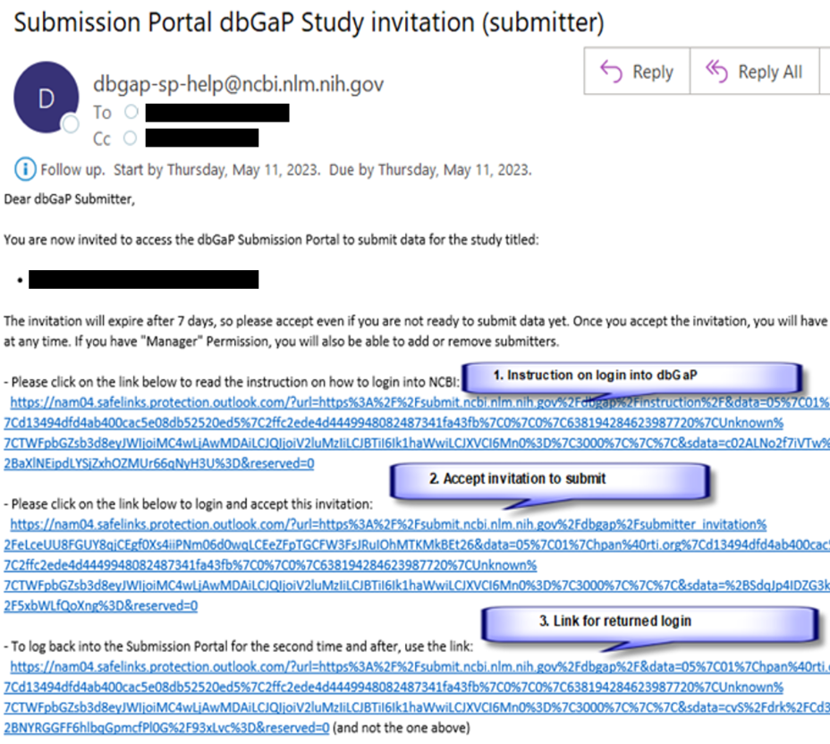
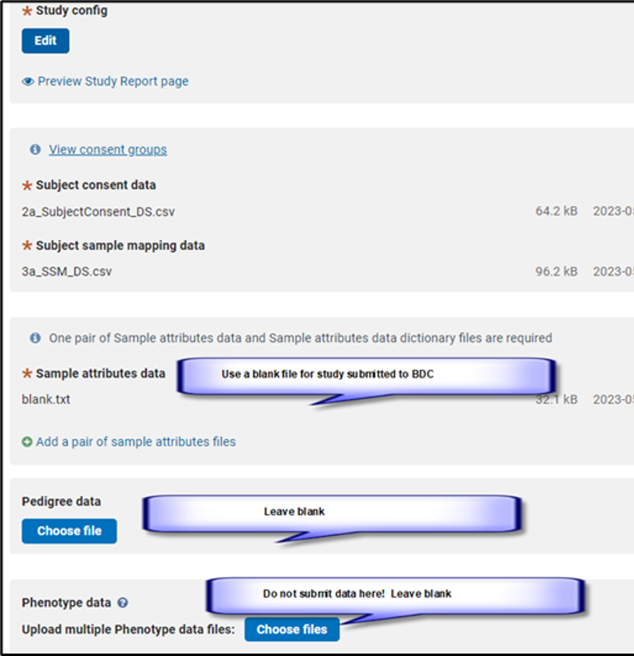
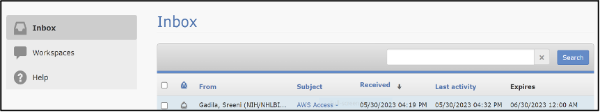
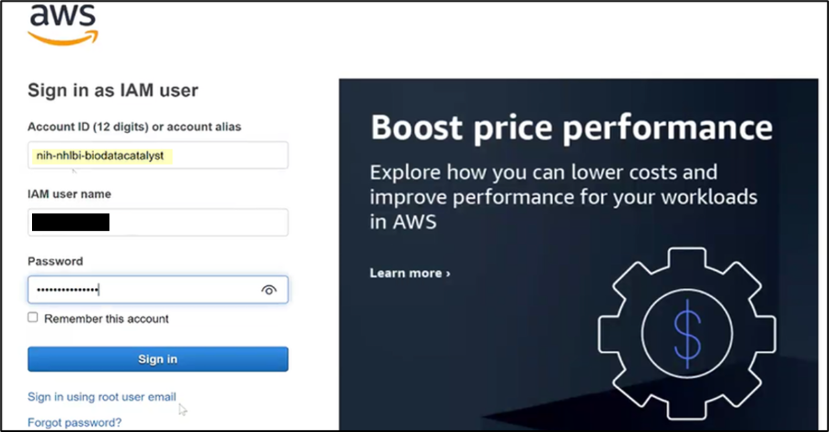
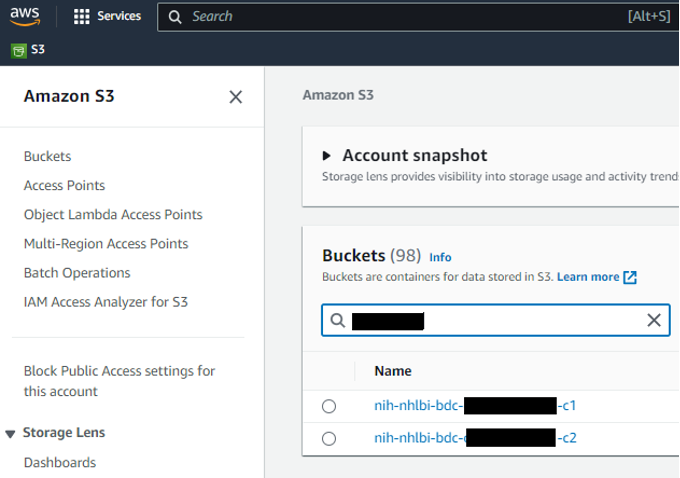
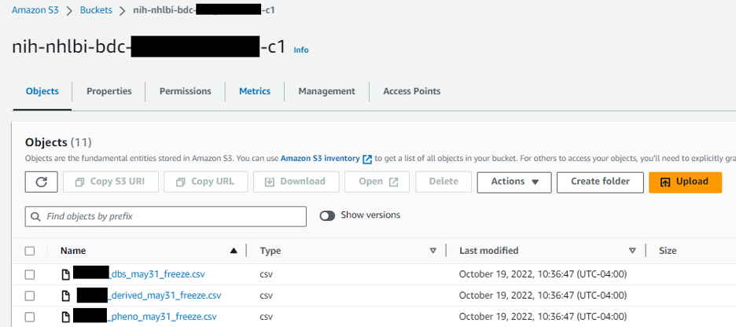
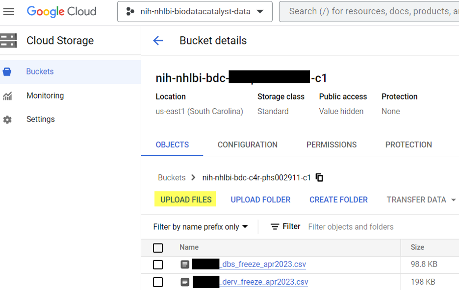

# Instructions for Data Submission to BDC

## Introduction

The five steps and their subparts outlined below provide instructions for submitting data and making it available through BDC. These instructions will be updated as new information and processes are made available.


**Tip: To reduce the time to ingest and release data, you may work on more than one action at a time.**

* If you have already prepared your data (see Step 3), you may complete Step 1 (Intent to Submit) and then simultaneously work on dbGaP Study Registration (see Step 2) and begin the Data Submission process (see Step 4).
* If you have not yet prepared your data, you may complete Step 1 (Intent to Submit) and then simultaneously work on dbGaP Study Registration (see Step 2) and Data Preparation (see Step 3).


### Step 1: Intent to Submit

This step has two data submitter action items, and the first is different for NHLBI intramural investigators than for extramural investigators.

:arrow\_right: **Data Submitter Action Item 1: for NHLBI Intramural Investigators**\
Email [NHLBIDIRBDCSubmission@mail.nih.gov](mailto:NHLBIDIRBDCSubmission@mail.nih.gov) for submission information.

:arrow\_right: **Data Submitter Action Item 1: for Extramural Investigators**\
Use the following email template, complete it with information specific to your study, and send it to [bdcatalystdatasharing@nih.gov](mailto:bdcatalystdatasharing@nih.gov).

**Email template:**

To: [bdcatalystdatasharing@nih.gov](mailto:bdcatalystdatasharing@nih.gov)\
Subject: BioData Catalyst Data Submission \[Grant Number / Award Number]&#x20;

| Study Name                                  |   |
| ------------------------------------------- | - |
| Institution Name                            |   |
| PI Name                                     |   |
| Grant Number/Award Number/ZIA Number        |   |
| Expected date for data upload/submission    |   |
| Does this submission include genomics data? |   |
| Does this submission include biospecimen?   |   |
| Does this submission include imaging data?  |   |

:white\_check\_mark: **Result**

After sending the email, you will receive an automated response with the following documents to use in Step 2.

* Institutional Certification Form
* Data Submission Information Sheet
* Guidance document for registration of data in dbGaP

:arrow\_right: **Data Submitter Action Item 2: Complete the Institutional Certification and Data Submission Information Sheet** (see results from Step 1, Action 1), and email them to [nhlbigeneticdata@nhlbi.nih.gov](mailto:nhlbigeneticdata@nhlbi.nih.gov).

:white\_check\_mark: **Results**

* You will receive a response from the Genomic Program Administrator (GPA) confirming receipt of your email.
* Extramural submitters will also receive a response from the BioData Catalyst Data Management Core (DMC) ([nhlbi.dmc.concierge@rti.org](mailto:nhlbi.dmc.concierge@rti.org)) to provide further assistance or answer data submission-related questions.


**Step 1 Related Links**

* [Data Submission Information Sheet](https://docs.google.com/document/d/1PUcukRJ7rtq-9GgFXvc4l2H5cPSqMkoU/edit)
* [DUL Statements for Institutional Certification](https://sharing.nih.gov/genomic-data-sharing-policy/institutional-certifications/completing-an-institutional-certification-form#step-5)


### Step 2: Study Registration in dbGaP

All research data shared with BDC must be registered through dbGaP, though the controlled and non-controlled access processes may differ. The DMC will contact you and provide specific guidance in such cases. Study registration has two parts but only one action for data submitters.

:blue\_circle: **The GPA completes the first part of dbGaP study registration and, as a result, generates your study accession number.** The GPA does this by entering information from your Institutional Certification and Data Submission Information Sheet into the dbGaP Submission System. If needed, the GPA may contact you for additional information or clarification or if asking for a data sharing plan and data use agreement.

:white\_check\_mark: **Results**

* The GPA will share the accession number and the consent group information with the DMC to create Data Submission Infrastructure for your study.
* You will receive an automated email from dbGaP to complete Study Submission (see screenshots of the dbGaP email below).

<figure><figcaption></figcaption></figure>

:arrow\_right: **Data Submitter Action Item 1: After receiving the automated email from dbGaP, complete the dbGaP submission process** using guidance available in the [dbGaP Study Configuration Process for Submission of Data to BDC](../dbgap-study-configuration-for-bdc.md) (See a screenshot of the dbGaP Study Submission portal below). Study Config consists of a web form that collects a description of the study data, methods, and findings, inclusion/exclusion, study history, references, attributions, and terms that will be indexed to enable users to search for your study in dbGaP Advanced Search.


**Note**: Gather all information ahead of the web form entry, as the current form does not have a “save” button for partial entry. Click [here ](https://drive.google.com/drive/folders/1Bptlz7jMDMGMADQpbs7CIxrhZLbYzW69?usp=drive_link)to download the example files for dbGaP submission.&#x20;


<figure><figcaption></figcaption></figure>

:white\_check\_mark: **Results**

* Once you finish your study configuration, dbGaP will curate your submission and may contact you for questions. Once dbGaP completes its curation process, you will receive an email from dbGaP to approve and complete your study registration.
* Note: While waiting for dbGaP curation, please proceed with data submission to BDC (steps 3 and 4 below) to reduce the time to ingest and release the data.

### Step 3: Data Preparation

Data preparation can happen before, during, or after the study registration process and must be completed to submit data to BDC. This step has one action item for all data submitters and a second action item for submitters of omics and phenotypic data types.&#x20;

:arrow\_right: **Data Submitter Action Item 1:** Prepare supplemental documentation to accompany the data submission (“data package”) according to the [Instructions for Preparing Clinical Research Study Datasets for Submission to the NHLBI](https://www.nhlbi.nih.gov/grants-and-training/policies-and-guidelines/guidelines-for-preparing-clinical-study-data-sets-for-submission-to-the-nhlbi-data-repository), including:

* Protocols
* BDC compliant Data Dictionaries
  * **Clinical Data** - Find dbGaP Data Dictionary description [here](https://www.ncbi.nlm.nih.gov/gap/docs/submissionguide/#8-what-is-a-phenotype-data-dicti) and a sample Data Dictionary file [here](https://docs.google.com/spreadsheets/d/1T5S9uDDduYtu8zHEQSkFf1qB6aU21oM8/edit?usp=drive_link\&ouid=111015420209812015356\&rtpof=true\&sd=true)
    * As separate files for each of the data files (not as a tab within the data file)\*
  * **Imaging Data** - Find dbGaP Data Dictionary description [here](https://www.ncbi.nlm.nih.gov/gap/docs/submissionguide/#15-how-do-i-submit-medical-image) and a sample Data Dictionary file [here](https://docs.google.com/spreadsheets/d/1vwmqe0KR3AYXLcYVM6XFgscKSWGJa8BA/edit?usp=drive_link\&ouid=111015420209812015356\&rtpof=true\&sd=true)
* Survey Instruments
* Data/Metadata model, if applicable
* Datasets Readme\*
  * Specify data file name and variable name for “subject ID” and “age”
  * Datasets organization - if the datasets are organized in multiple sub-folders, need a Readme file to describe the relationship of the sub-folders, if they are independent (e.g., multiple phases or visits), main studies with ancillary studies, or overlapping (e.g., /raw data and /harmonized data, where the /harmonized data is a subset of the /raw data).
  * Describe the de-identification methods, see example file [here](https://bdcatalyst.gitbook.io/biodata-catalyst-documentation/data-management/data-submission-instructions/de-identification-readme) \*
* Additional Supplemental documentation to reproduce study results

_\* Supported documentation types for data dictionaries and models are .csv, tab-delimited, xml, json, and other machine-readable formats. PDF and SAS file formats are not machine-readable and are discouraged from submission. File name should not include any spaces and special characters._

:arrow\_right: **Data Submitter Action Item 2:** Only for Omics and Phenotypic data types, prepare the data files per the [dbGaP Study Submission Guidance](https://www.ncbi.nlm.nih.gov/gap/docs/submissionguide/#aconfig).

### Step 4: Data Submission to BioData Catalyst (BDC)

Data submission has two action items for data submitters. This process can happen in parallel with Data Submitter Action Item 1 from Step 2. The data submission process begins by filling out the BDC contact form: [https://biodatacatalyst.nhlbi.nih.gov/contact](https://biodatacatalyst.nhlbi.nih.gov/contact).

:arrow\_right: **Data Submitter Action Item 1: Request bucket creation by filling out the BDC contact form using the following information:**

* Your institutional email address used for NIH eRA Commons
* Subject: Data Submission
* Type: Data Submission (select in the dropdown menu)
* In the body of the message, 1) include your dbGaP PHS accession number and 2) request access for read/write permission to the assigned cloud bucket
  * In the rare case that your institute can’t access any cloud services hosted by Google or Amazon, request assistance for direct data upload from your data package location (e.g., SFTP transfer)

Data upload may not begin until your data is prepared (see Step 3: Data Preparation), and you receive an invitation from dbGaP to complete your study submission and configuration (see the Results section in Step 2.

:arrow\_right: **Data Submitter Action Item 2: Access the cloud bucket created for your study.** You will receive a secure email from the Information Technology Applications Center (ITAC) team at NHLBI that provides the URL to activate the access with user ID and password (see screenshot below):

<figure><figcaption></figcaption></figure>

Follow the links and instructions in the email to activate the Amazon Web Service (AWS) S3 web interface.

<figure><figcaption></figcaption></figure>

If you have any questions or issues about accessing the buckets, please contact [nhlbi.dmc.concierge@rti.org](mailto:nhlbi.dmc.concierge@rti.org)

:arrow\_right: **Data Submitter Action Item 3: Upload data sets to the cloud bucket created for your study.** After access, upload datasets for each consent group to the corresponding buckets (e.g., xxxx-c1) as described in the dbGaP 2b file.

<figure><figcaption></figcaption></figure>

Once selected the specific bucket for a consent group, use the “Upload” button to upload data files.

<figure><figcaption></figcaption></figure>

&#x20;If you choose to use the GCP platform, see screenshot below (“upload” highlighted)

<figure><figcaption></figcaption></figure>

### Step 5: Next Steps

Once your data package is uploaded successfully, the data go through quality checks before ingestion and release. If issues are found, the DMC will contact you and assist in resolving the issues before ingestion and release. There are three data submitter action items associated with this step.

:arrow\_right: **Data Submitter Action Item 1: If the DMC contacts you about QC issues with the uploaded data, respond to their inquiries to resolve the issues.**

:arrow\_right: **Data Submitter Action Item 2: If requested by the DMC, resubmit the data package after all issues are resolved.**

After data clears the data quality checks, the ingestion and release process can take as few as 4-6 weeks. After the data is released, the DMC will notify you that your study is available for use by authorized individuals in BDC ([study inventory](https://biodatacatalyst.nhlbi.nih.gov/resources/data/studies/)).

:arrow\_right: **Data Submitter Action Item 3: You are encouraged to log in and view your study data in BDC.**

## Need Assistance?

Contact the BioData Catalyst Data Management Core (DMC) via [https://biodatacatalyst.nhlbi.nih.gov/contact](https://biodatacatalyst.nhlbi.nih.gov/contact) and select “Data Submission” in the Type field.
