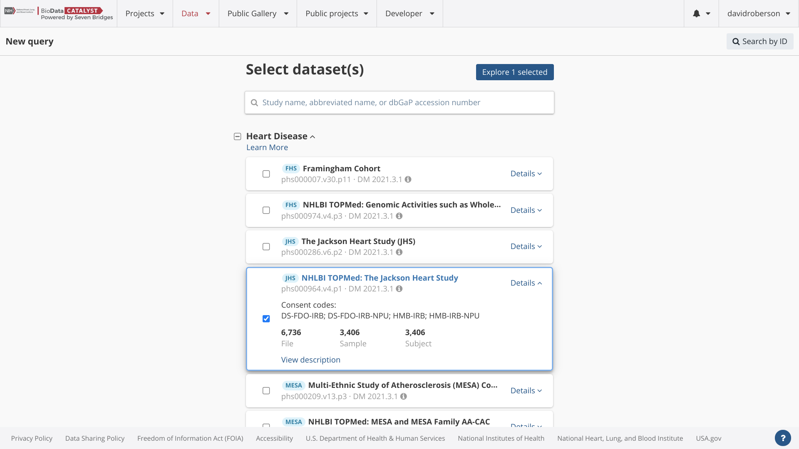
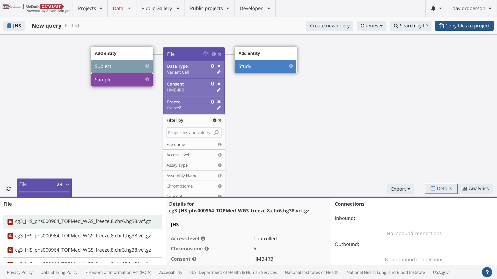
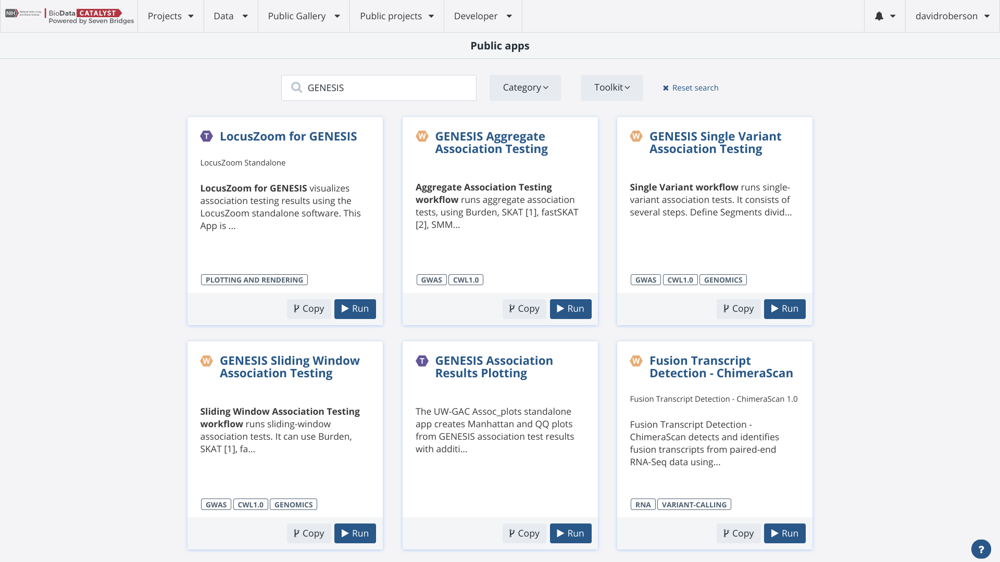
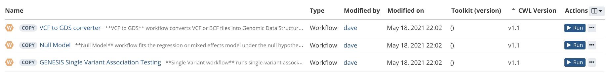
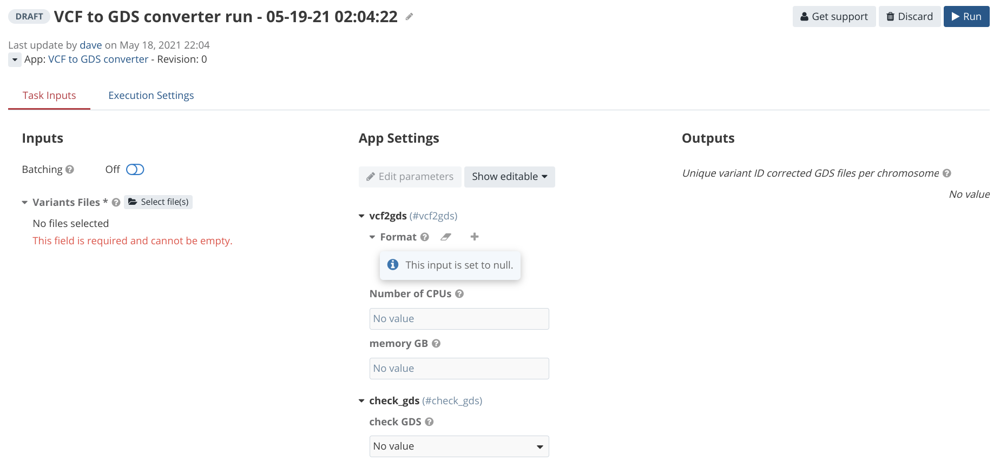
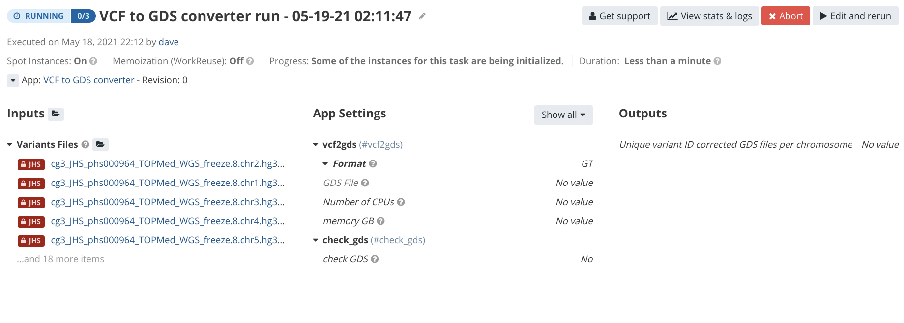

# Genetic Association Testing using GENESIS Workflows

## Objectives

This tutorial guides users through the steps of running a single variant or multiple variant association test on _BDC-Seven Bridges_ using the GENESIS R package pipelines. This tutorial is designed to be a starting point for researchers who have a general understanding of genome-wide association studies. Previous use of R or the GENESIS package is not required.

## Prerequisites

Prior to beginning this tutorial, you should review the [Getting Started Guide](https://bdcatalyst.gitbook.io/biodata-catalyst-documentation/written-documentation/getting-started/analyze-data-1/seven-bridges/getting-started-guide) which provides step-by-step instructions on:

* Accessing hosted TOPMed datasets on BDC
* Creating an account with eRA Commons credentials
* Creating projects
* Running a practice analysis
* Using the Data Browser feature

## Overview of the GENESIS pipelines

The **GENetic EStimation and Inference in Structured samples (GENESIS) R** package provides efficient methods of working with genotypes measured in sequencing and microarrays. These tools were developed by the TOPMed Data Coordinating Center (DCC) at the University of Washington. The Seven Bridges team worked with the TOPMed DCC to create Common Workflow Language (CWL) tools for the GENESIS R functions and arranged these tools into computationally efficient workflows.

The GENESIS workflows are a good fit for performing association studies on TOPMed data because of their robust ability to estimate and account for population and pedigree structure. GENESIS implements linear mixed models for association testing of quantitative phenotypes and logistic mixed models using the penalized quasi-likelihood approach of [**GMMAT**](https://www.ncbi.nlm.nih.gov/pubmed/27018471) for association testing 1 of binary (e.g. case/control) phenotypes. The mixed models utilize the [**PC-AiR**](https://www.ncbi.nlm.nih.gov/pubmed/25810074) PCs and a relatedness matrix of [**PC-Relate**](https://www.ncbi.nlm.nih.gov/pubmed/26748516) kinship coefficient estimates to accurately and efficiently adjust for ancestry and relatedness in the sample. When no relatedness matrix is provided, simple linear or logistic regression models are used for quantitative or binary traits, respectively. Heterogeneous residual variances can be used to account for differences in quantitative phenotype variability by user-specified group. For computational efficiency, a “null model” is fit once under the null hypothesis of no genotype effect, and variant association is subsequently tested genome-wide. Available association tests include single variant tests as well as multiple variant aggregate tests. Single variant tests are performed with score tests, and approximations of effect sizes are provided. The saddlepoint approximation (SPA) of p-values is available [when testing binary phenotypes](https://www.nature.com/articles/s41588-018-0184-y). Multiple variant tests can be performed using the burden, [**SKAT**](https://www.ncbi.nlm.nih.gov/pmc/articles/PMC3135811/), [**SKAT-O**](https://www.ncbi.nlm.nih.gov/pubmed/22699862), [**fastSKAT**](https://www.ncbi.nlm.nih.gov/pubmed/29932245), and [**SMMAT**](https://www.ncbi.nlm.nih.gov/pubmed/30639324) methods. Each of these methods can be run with user-defined variant groupings (e.g. by gene) or with a sliding window approach, and they can incorporate either allele frequency-based or user-defined (e.g. utilizing variant annotation) variant weighting. GENESIS can utilize sparse matrix representation of relatedness and genotype matrices for a substantial reduction in computational demand in large samples such as TOPMed.

This tutorial will first guide you through the steps of performing a single variant association test using TOPMed study data and then move on to a multiple variant test. The overall steps of the single variant test are as follows:

1. Create your project
2. Bring TOPMed VCF data to your project
3. Upload kinship and PCA data
4. Bring the GENESIS workflows to your project
5. Convert VCF files to GDS file format
6. Upload harmonized phenotype or create harmonized phenotype in RStudio on platform
7. Fit Null Model
8. Run the single variant association test workflow

For more information on association testing with the GENESIS R package, refer to the following:

* **Gogarten SM**, Sofer T, Chen H, Yu C, Brody JA, Thornton TA, Rice KM, Conomos MP. 2019. Genetic association testing using the GENESIS R/Bioconductor package. Bioinformatics. Btz567. [**https://doi.org/10.1093/bioinformatics/btz567**](https://doi.org/10.1093/bioinformatics/btz567)
* Course materials for “Computational Pipeline for WGS Data” at the Summer Institute for Statistical Genetics: [**https://uw-gac.github.io/SISG\_2020/**](https://uw-gac.github.io/SISG_2020/) &#x20;
* GENESIS software can be found on Bioconductor and Github: [**http://bioconductor.org/packages/release/bioc/html/GENESIS.html** ](http://bioconductor.org/packages/release/bioc/html/GENESIS.html)[**https://github.com/UW-GAC/GENESIS**](https://github.com/UW-GAC/GENESIS)

## Organizing a Workspace and Preparing Data

Prior to running the association test, you will need to complete some preparation work. The following steps will cover:

* Create a project for the test GWAS
* Add variant data to a secure project on the platform
* Find the GENESIS workflows on the platform and add them to a project
* Run the VCF to GDS tool to get the variant data in the appropriate format for the GENESIS workflows
* Access RStudio for use in phenotype harmonization
* Fit Null Model

### Project Creation

The first step is to create a secure project for working with the WGS data. Projects are workspaces that serve as the core building blocks of _BDC-Seven Bridges_. Each project corresponds to a distinct scientific investigation and serves as a container for data, analysis workflows, and results. Multiple analyses can be carried out within a project.

For more information about project creation, see the [Getting Started Guide](https://bdcatalyst.gitbook.io/biodata-catalyst-documentation/analyze-data/seven-bridges/getting-started-guide). The following terms will be used throughout the tutorial.

* **Project:** Workspace for organizing files and analyses.
* **App:** Bioinformatics tools and workflows. There are hundreds of Apps hosted on the platform and users can also bring their own.
* **CWL:** Common Workflow Language. All hosted tools and workflows are described in CWL which is both human and machine-readable and has all the necessary information to run the tool in a reproducible way.
* **Task:** Single execution of a bioinformatics tool or workflow.

To complete the steps in this tutorial, create a new project with the title **test GWAS**. Choose the following settings for the project:

* **Billing Group:** Pilot Funds
* **Location:** aws-us-east-1
* **Spot instances:** On
* **Memoization:** Off
* **Controlled data:** Yes
* **Network Access:** Block Network Access

### Accessing TOPMed WGS variant (VCF) data

You can find data from the hosted TOPMed studies in the **Data Browser**. This includes multi-sample VCF files and phenotype data on a per study and consent code basis, as well as single-sample VCF files and CRAM files. In the Data Browser, you can search over open metadata for the hosted TOPMed studies. However, users can only bring files to a project for analysis if they have dbGaP approval to work with the selected files.

For this tutorial, select one or more TOPMed studies that you are approved to access. Choose **Explore selected** and then search for the consent codes you are approved for and the multi-sample VCFs. The following example shows how to do this for the “HMB-IRB” consent group of the Jackson Heart Study. The instructions are written for this specific example, but note that you will not be able to bring these data to a Project unless you are approved for this study and consent group. Therefore,  follow the flow for a study and consent group that you have approval for in dbGaP.

After selecting Explore 1 selected, the visual graph query builder pops up where you can search over open metadata for the TOPMed studies. Select to search over the File entity and then select the “Data Type” property within the File entity. Listed are Aligned Reads (CRAMs), Simple Germline Variation (single-sample VCF files), the Unharmonized Clinical data (clinical data from dbGaP), and Variant Call (the multi-sample VCFs). Filter by the Variant Calls and refresh in the lower left-hand corner.

Next, search for consent groups by selecting the “Consent” property under the File entity. Choose your consent groups, filter by this property, and refresh results. For Jackson Heart, we will select the “HMB-IRB” consent group. After that, search for the “Freeze” and select the “freeze8”. This search identifies 23 files in vcf.gz. Now select “Copy files to project.” This links these files to your project (as opposed to duplicating the files on storage infrastructure). Since the identified files are controlled access, they must be copied to a project marked as controlled (selected during project creation).

Verify that the files are in your designated project by opening the “test GWAS” project and going to the “Files” tab.

### Adding GENESIS Apps from Public Gallery

The Seven Bridges bioinformatics team worked with the TOPMed Data Coordinating Center to bring CWL versions of the GENESIS pipelines to BDC. These workflows were optimized for the cloud and can be found in the Public Gallery as shown below:

To find the pipelines click on **Public Gallery - Apps** and search for “GENESIS.” You will find the VCF to GDS workflow, the null model workflow, and 3 options for association testing (single variant, aggregate, sliding window). For the needed workflows, click Copy and select your working project as a destination.

For this tutorial, please copy the following workflows to the “test GWAS” project:

* VCF to GDS
* Null model
* Single-variant association testing

On the right side of the screen click on “copy” and add these tools to your test GWAS project. You should now see all three workflows in the Apps tab of your “test GWAS” project.

### VCF to GDS Conversion

The next key step for running the GENESIS pipelines is to convert the VCF files into the GDS format. TOPMed variant data is in the VCF file format. The Freeze 8 data will have 1 VCF file per chromosome. However, the GENESIS packages require the inputs to be in the Genomic Data Structure (GDS) format. Therefore, now that the data files have been added to the project, the next step is to convert them to GDS files using the “GENESIS VCF to GDS” workflow.

This workflow is composed of three tools. Step 1 (**vcf2gds**) converts VCF or BCF files (one per chromosome) into GDS files, with the option to keep a subset of FORMAT fields, by default only GT field. Step 2 (**Unique Variant IDs**) ensures that each variant has a unique integer ID across the genome. Step 3 (**Check GDS**) ensures that no important information is lost during conversion. If **Check GDS** fails, it is likely that there was an issue during the conversion. This step is time-consuming (and therefore expensive). The execution is approximately 10 times longer than the rest of the workflow. Also, the failure of Check GDS is rare and for those reasons this step is optional. The workflow will run **vcf2gds** once per chromosome and check that each uses the **unique\_variant\_id** app to make sure each variant in the new GDS has a unique integer id.

When you are ready to run the workflow, click on the Apps tab in your project and select “Run” on the VCF to GDS conversion app. Your next screen will show a DRAFT Task setup page and look like this:

Select the VCF files in your project and add them as the **Variant Files** input. The app will process them all in parallel. This is an example of a form of cloud platform parallelization called **scattering**.&#x20;

Click **RUN** and your next screen will look like:

The task will go through 3 status labels: **Queued**, **Running**, and **Complete**. Once your task is complete you will be able to continue with the next section. Once completed, your GDS file outputs will be listed under the “Outputs” section of the completed Task page. Please note that you will only need to generate the GDS files once for a particular set of samples. These GDS files can be used in multiple association tests with different phenotypes.

This pipeline expects that input VCF files are separated per chromosome and that file is properly named. The expected format of the file name is: **prefix\_chr##\_suffix.\[bcf, vcf, vcf.gz]**, where the “##” is the name of the chromosome (1-24, or X, Y).

The parameter for “number-of-CPUs” should only be used when working with VCF or VCF.GZ files. The workflow is unable to utilize more than one thread when working with BCF files and changing this input parameter will have no effect in this case. Variant IDs in output workflow might be different than expected. Unique variants are assigned for one chromosome at a time, in ascending order, and chromosomes are sorted in natural order (1,2,3,..,24, or X,Y). Variant IDs are integer IDs unique to your data and do not map to rsIDs or any other standard identifier. Be sure to use **variant\_id** file for down-the-line workflows generated based on GDS files created by this workflow.

_**Please note that if you are working with multiple TOPMed studies or consent groups, we recommend first merging VCFs from the separate studies/consent groups into a single VCF and then converting that single VCF file to the GDS format.**_ This was found to be faster than converting multiple VCFs to the GDS format and then merging the GDS files. We recommend using Bcftools Merge to combine the VCF files. In the Public Apps Gallery there are two versions of this app: BCFtools merge and BCFtools merge DCC. The second version is BCFtools merge which includes a filter for monomorphic variants. When working with the datasets that have monomorphic variants such as TOPMed datasets, BCFtools merge DCC is highly recommended. The end results should be a single VCF file per chromosome. Each VCF should include all samples in your analysis cohort.

### Uploading additional files for the association test

In addition to the VCF files, you will need the following files to perform the GWAS:

* Principal components
* Kinship matrix
* Phenotype file

BDC hosts files from the TOPMed Combined Exchange Area which includes principal components files and kinship matrix files. However, only users with access to the TOPMed Combined Exchange Area on dbGaP can access these files on BDC. Researchers who do not have access can upload these file types to the project using either the command line uploader (linux) or the GUI-based Desktop Uploader (Windows, Mac OS, Linux), both of which can be found under “Data Tools” in the Data tab of the top navigation bar. **Please refer to the** [**Documentation pages on “Bring your own data”**](https://sb-biodatacatalyst.readme.io/docs/upload-to-the-platform) to read additional details on how to use these features. In addition, for researchers who already have their own harmonized phenotype file, they may also upload this directly to the system.

### Phenotype Harmonization

Many researchers need to perform phenotype harmonization for their association studies. This step can include renaming, transforming, or otherwise processing measured clinical variables to create a comparable variable across studies for one or more phenotypes of interest. We recommend using the platform implementation of RStudio for these steps (Jupyterlab notebooks are also available). The first section below outlines how to find the hosted raw phenotype files on the platform. The second section describes how to use RStudio.

You may also find it helpful to refer to the [**GENESIS tutorial public project**](https://platform.sb.biodatacatalyst.nhlbi.nih.gov/u/biodatacatalyst/genesis-tutorial/) on the platform. There is a phenotype harmonization example with 1000 Genomes data.

### Find hosted phenotype data in Data Browser

BDC hosts phenotype files for each TOPMed study and consent code. Phenotype data is hosted in the same format as it is found on dbGaP, in tar files that can be decompressed. In addition, the system hosts the raw phenotype data in the avro, tar, xml, and txt file format. The phenotype data can be found in the Data Browser feature. The TOPMed parent studies are listed on the first page of the Data Browser. Select your study of interest and then proceed to the visual interface. Search over the **File** entity, choose the **Data Type** property and select the “unharmonized clinical data.” In addition, be sure to search for the consent group(s) you have access to. After refreshing your results, you will find both the tar format files and the avro format files. Select **Copy files to project** which will link the files to your “test GWAS” project.

### RStudio on the platform

RStudio can be opened from within projects. From the “test GWAS” project, go to the upper right-hand corner and select **Interactive Analysis**. Then select the **Data Cruncher** feature and “Create your first analysis.” After naming your analysis, select to open **RStudio**.

You will have the option to select an instance type. The default instance (aws c3.2xlarge) will be sufficient for this tutorial.&#x20;

Users can also set the **Suspend time** which is the period of analysis inactivity after which the instance is stopped automatically. Inactivity implies that: no files have been modified or created under the **Files** tab -AND- there are no running jobs. When the suspend time is reached, the instance and analysis are stopped. All files are saved that meet the criteria for automatic saving or have been manually selected to be saved as project files. All other files will be lost. By setting suspend time, you don’t have to worry about stopping the RStudio instance to prevent it from continually running in the background.

Make sure to click **Open in editor** once the RStudio instance has been initialized. This will open a new window which contains the RStudio IDE.

The cloud version of RStudio is the same software that you would run locally with the exception that Seven Bridges has pre-installed a number of R packages, including the tidyverse packages (dplyr, ggplot2, readr, and tidyr). For more information on launching RStudio in the cloud please see the documentation at [https://sb-biodatacatalyst.readme.io/docs/rstudio-quick-reference](https://sb-biodatacatalyst.readme.io/docs/rstudio-quick-reference).

### Formatting the phenotype file for GENESIS

The GENESIS workflows expect the data in the phenotype file to be provided as an AnnotatedDataFrame, which can be constructed from a standard R data.frame using the AnnotatedDataFrame() function in the Biobase package. All phenotype data to be used in the association testing models should be present in the phenotype file, including the outcome, covariates, and group variate values (principal components of ancestry do not need to be included, as they can be specified via a special PCA file). The only other requirement is in regard to how the unique sample identifiers (i.e. sample.id) are specified. The sample.ids must take the same values as the sample.id in the GDS genotype files (which will be the same sample identifiers from the VCF files if constructed using the VCF to GDS conversion workflow). The sample.id must be provided in a column named ‘sample.id’.

### Preparation of Other Optional Files for GENESIS

#### Ancestry and relatedness

GENESIS implements PC-AiR, which unlike standard principal components analysis (PCA), accounts for relatedness in the sample to provide accurate ancestry inference that is not confounded by family structure. In addition, GENESIS implements PC-Relate, which uses ancestry representative principal components (PCs), such as those from PC-AiR, to adjust for population structure and provide accurate estimates of kinship coefficients. An ancestry and relatedness inference pipeline utilizing these methods is being developed on the Seven Bridges platform; until that pipeline is released, these analyses can be performed in R using the GENESIS library or pre-computed PCs and kinship coefficients for TOPMed Freeze 8.

Inclusion of ancestry PCs and/or a kinship coefficient matrix is not required to run the GENESIS association testing workflow, but it is generally recommended in TOPMed, as most studies have complex population and/or pedigree structure.

The GENESIS association testing workflow expects ancestry PCs to be provided as an RData object in a separate PCA file. R object type may be “pcair”, data.frame or matrix. “pcair” is an object created by the pcair() function in the GENESIS package; Row names of R object must contain sample identifiers that match sample.id from the GDS file.

The GENESIS association testing workflow expects the kinship matrix to be provided as an RData or GDS file. For RData files, R object type should be of class matrix or Matrix, with pairwise kinship coefficients as the matrix entries and sample.id as both the rownames and colnames. Using the GENESIS package, the output of the pcrelate() function can be transformed to this format using the pcrelateToMatrix() function. Sparse matrices are supported for significantly improved computational efficiency in large samples and can be constructed using the \`thresh\` parameter of the pcrelateToMatrix() or makeSparseMatrix() functions in GENESIS. Other types of relatedness matrices, such as a genetic relatedness matrix (GRM) calculated with [**GCTA**](https://www.cell.com/ajhg/pdf/S0002-9297\(10\)00598-7.pdf), can be used in the GENESIS association testing workflow, as long as they are provided in the specified file format.

### Running an analysis on a subset of samples

Researchers may want to run an analysis with only a subset of the samples in their project. Rather than requiring subsetting of the GDS file, Phenotype file, PCA file, and Relatedness Matrix file, a subset of samples can be specified by using the Sample include file. This Sample include file should be an RData file with a vector of sample.id to include in the analysis. When not specified, all samples in the provided data are analyzed.

### Running an analysis on a subset of variants

Researchers may want to run an analysis with only a subset of variants included in their GDS genotype files. Rather than requiring them to create a new GDS file, a subset of variants can be specified for analysis by using Variant Include files. There should be one Variant Include file per chromosome being tested; the expected format of the file name is **prefix\_chr##\_sufix.RData**, where “##” is a name of a chromosome (1-24 or X,Y). Each of these RData files should be a vector of variant.id (matching the ‘variant.id’ field in the GDS file that was assigned by the VCF to GDS conversion Unique Variant ID step) to include in the analysis. When combined with other variant filters (e.g. PASS only, MAC threshold, MAF threshold), only variants specified in the Variant Include files and passing the filters will be analyzed.

### Fit Null Model

The next step is to fit a **Null Model**. The **Null Model** workflow fits the regression or mixed effects model under the null hypothesis of no genotype effects; the outcome variable is regressed on only the specified fixed effect covariates and random effects. The single variant genotypes or multiple variant aggregation units are not included in this model. The output of this Null Model is then used in the association test workflow of choice.

This workflow consists of two steps: The first step fits the **Null Model**, and the second step generates reports based on the fitted model and data. Reports are available both in Rmd and html format. This workflow utilizes the `fitNullModel` function from the GENESIS software.

Both continuous (**family** = “gaussian”) and discrete (**family** = “binomial” or “poisson”) phenotypes are supported. The outcome and covariate values must be included in the **Phenotype** **file** and specified with the **Outcome** and **Covariates** parameters. Principal components of ancestry can be included as covariates using the PCA file input, and genetic relatedness can be accounted for as a random effect using the **Relatedness matrix file** input. For more information, see the section on **Ancestry and Relatedness** above.

When working with a quantitative phenotype, heterogeneous residual variances by group can be specified using the **Group variate** parameter.

If **pca\_file** is not provided, the **n\_pcs parameter** must be set to 0. **pca\_file** must be an RData file with object type “pcair”, data.frame, or matrix. For more information, see the section on **Ancestry and Relatedness** above. The **Null Model** job can be very computationally demanding when fitting mixed models in large samples (for example, greater than 20K). GENESIS supports using sparse representations of matrices in the relatedness\_matrix\_file using the R Matrix package, and this can substantially reduce memory usage and [CPU time](https://www.ncbi.nlm.nih.gov/pubmed/27018471).

## Running Single Variant Association Tests

To perform a single-variant association test, use the **GENESIS Single Variant Association Testing** workflow. The single-variant test is similar to a traditional GWAS and consists of several steps. First, the **define\_segments.R** tool divides the genome into segments, either by a set number of segments or by segment length. Note that number of segments refers to the whole genome, not a number of segments per chromosome. Next, the association test is performed for each segment in parallel, before combining results on the chromosome level. The final step in the workflow produces QQ and Manhattan plots of the association p-values.

This workflow uses the output from the null model workflow and the genotype data to perform score tests for all variants individually. The reported effect estimate is for the alternate allele, and multiple alternate alleles for a single variant are tested separately. When testing a binary outcome, the saddlepoint approximation (SPA) for p-values (see [**here**](https://www.nature.com/articles/s41588-018-0184-y) and [**here**](https://www.ncbi.nlm.nih.gov/pubmed/28602423)), can be used by specifying **test\_type 11 12 = ‘score.spa’**; this is generally recommended. SPA will provide better calibrated p-values, particularly for rarer variants in samples with case-control imbalance.

If your genotype data has sporadic missing values, they are imputed to the mean alternate allele count using the allele frequency observed in the sample.

On the X chromosome, males have genotype values coded as 0/2 (females as 0/1/2).

This workflow utilizes the `assocTestSingle` function from the GENESIS software.

**Assoc\_single job** can be very memory demanding, depending on the number of samples and null model used. For more information on optimal resources needed for an Assoc\_single job, see the [GENESIS benchmarking guide](https://bdcatalyst.gitbook.io/biodata-catalyst-documentation/analyze-data/seven-bridges/gwas-page-placeholder). If a run fails with **error 137**, and with the message “killed” displayed, the likely cause is a lack of memory.

Your completed task for the GENESIS Single Variant Association test should be similar to the following image.

## Multiple-variant Association Tests

Multiple-variant association tests are often used when analyzing variants from WGS or WES studies since they jointly test a group of variants and can increase power when using rare variants. These tests are also referred to as aggregate tests and each grouped variant set can be referred to as an aggregation unit. This section of the tutorial describes multiple-variant association tests where the user specifies sets of variants to be jointly tested using genomic annotations. _BDC-Seven Bridges_ also has the **GENESIS Sliding Window Association Testing** app which aggregates variants by genomic positions. The sliding window test will not be covered in this tutorial and more information can be found in the [app description](https://platform.sb.biodatacatalyst.nhlbi.nih.gov/resources/public-gallery/apps/261857bc-5b40-4a52-b9ab-cf58e92adaeb).

## Preparation of Files for Multiple Variant Associations using GENESIS

When performing multiple-variant association where the variant sets or groups are specified by the user, the user must provide a variant grouping file and, optionally, a variant weight file. The format of these files is described below. Both these files can be generated using the Annotation Explorer feature.

### User provided variant groupings for aggregate tests

When performing multiple variant aggregate association tests, you can specify the groups and the variants that should be grouped under them using a variant grouping file. This is an RData file with a data.frame object defining aggregate groups. If the value for the config parameter ‘aggregate\_type’ is ‘allele’, columns should be ‘group\_id,’ ‘chr,’ ‘pos,’ ‘ref,’ ‘alt.’ Value of ‘group\_id’ is a group identifier (e.g. gene name) under which the variant specified by ‘chr’, ‘pos’, ‘ref’, ‘alt’ should be grouped. A given variant can be assigned to more than one group by including multiple row entries for that variant, each with a different ‘group\_id.’ Variant grouping files of this format can be generated using the **Annotation Explorer** feature, which allows the user to filter and group variants based on annotations. If the value for the config parameter ‘aggregate\_type’ is ‘position,’ columns should be ‘group\_id,’ ‘chr,’ ‘start,’ ‘end.’ The latter format is used to group variants in the contiguous genomic regions defined by ‘chr,’ ‘start,’ ‘end.’ Only variants that pass the specified variant filters (for example, PASS only, MAC threshold, MAF threshold) will be included in the aggregate analysis, even if they are included in the variant grouping file.

### User provided variant weights for aggregate tests

When performing multiple variant aggregate association tests, a researcher may want to weigh each variant included in the aggregation unit. You can specify weights, perhaps based on variant annotation information, using a Variant Weight file. This RData file should be a data.frame with columns ‘variant.id’ (matching the ‘variant.id’ field in the GDS file that was assigned by the VCF to GDS conversion Unique Variant ID step), or ‘chr,’ ‘pos,’ ‘ref,’ ‘alt’ to identify the variant, and a column of weights; the name of the column of weights can be anything and is provided via the Weight user parameter. If a variant grouping file is used (see previous section), “Weight user” may also refer to a column in that file and a separate variant weight file is not needed.

## Annotation Explorer

### Overview

The **Annotation Explorer** is an application developed by Seven Bridges in collaboration with the TOPMed Data Coordinating Center. The application enables users to interactively explore, query, and study characteristics of an inventory of annotations for the variants called in TOPMed studies. This application can be used pre-association testing to interactively explore aggregation and filtering strategies for variants based on annotations and generate input files for multiple-variant association testing. It can also be used post-association testing to explore annotations associated with a set of variants, like variant sets found significant during association testing.

The Annotation Explorer currently hosts a subset of genomic annotations obtained using [Whole Genome Sequence Annotator](https://jmg.bmj.com/content/53/2/111) software for TOPMed variants. Currently, annotations 13 for TOPMed Freeze 5 variants and TOPMed Freeze 8 variants are integrated with the Annotation Explorer. Researchers who are approved to access one or more of the TOPMed Freeze 5 studies will have the ability to access the Freeze 5 data on Annotation Explorer. Access to annotations for Freeze 8 data will be made available after the Freeze 8 data is released on dbGaP.

For the purposes of this tutorial, we will use the Annotation Explorer to generate a variant grouping file by applying a simple variant filtering and aggregation strategy using annotations from TOPMed Freeze 5.

### Launch Annotation Explorer

The Annotation Explorer is currently implemented as an interactive analysis which has all the code to launch an interactive R shiny application. To launch the explorer, select **Public projects** from the top navigation menu, then select **Annotation Explorer**.

Select **Interactive Analysis** in the upper-right hand corner of the dashboard and then select Open for the **Data Cruncher**. Select the **latest** analysis for the Annotation Explorer. You will be directed to the following page:

Copy this analysis to your “test gwas” project using the **Copy** button in the upper right hand corner,  then go back to your “test gwas” project. Select **Interactive Analysis** and open **Data Cruncher** (middle tile).

Start the Annotation Explorer analysis by pressing the blue “play” button. Once the RStudio instance has been initialized, which takes a few minutes, click the “open editor” button which has replaced the play button in the image below. For more information about RStudio cruncher please see the knowledge center RStudio documentation at [https://sb-biodatacatalyst.readme.io/docs/rstudio-quick-reference](https://sb-biodatacatalyst.readme.io/docs/rstudio-quick-reference).

The RStudio interface will open up (shown below). Click “Run App” at the top right-hand corner of the app.R script to launch the interactive R shiny app in a new window.

.png>)

The Annotation Explorer will pop up and look similar to the following screenshot.

Select on **Start Exploring**.

## Authentication and Data selection

After starting the Annotation Explorer you will need to enter your private authentication token. Follow the provided link to the platform page where you can generate your API token (see below) and select **Generate Token**. Copy the token to your clipboard and go back to the Annotation Explorer.

Paste your API token into the space provided then select **Authenticate**. A message in a green bar will appear to let you know if the authentication was successful.

Next, under the **Project and Data Selection** tab, select your Destination project as “test gwas”. This is the project where all of the output files will be stored. Under Dataset and Table selection, choose “freeze\_8”, click “**Next**” and then “ **Send request to BigQuery**.”

After these steps, we will be informed that authentication is successful.

This should take about 20 seconds and will result in a preview (1,000 rows) of the unfiltered annotations. The Dataset Info page (see image below) is a great place to learn about the annotations available for your research in real-time. The Metadata Explorer tab gives text descriptions of the hundreds of annotations available. The Data Explorer gives distribution and summary statistics for the 100’s of annotation fields.

The final section of the Annotation Explorer application is the query composer where you can interactively create the aggregation units for the subsequent association tests.

Scroll down to set the filters.

For this example, we will filter for variants that have a CADD\_phred score of greater than 20 and contain the term “missense” in the VEP\_Ensembl\_Consequence field.

Click “Filter” towards the bottom of the app screen. This filters through the 100’s of millions of variants by using the parameters we loaded in. The process takes only a few seconds and it will create a new table with only the filtered variants.

Now navigate to the aggregation tab. Select VEP\_ensembl\_Gene\_ID for the aggregation field and click on **Aggregate**.

The **Interactive plots** tab is used to QC the total number of aggregate units and the number of variants within each aggregation.

Finally, go to the **Export results** tab and fill out the section titled “Save variant grouping folder to project.” Click the “**Save to project** ” button. The aggregate files will be saved to the root directory of your project. There will be 1 file for each chromosome.

When you are done using the Annotation Explorer, please make sure to close out by going to “Close Window/Stop App” on the side navigation bar.

### Running Multiple-variant association test

If you want to perform a multiple-variant association test by specifying aggregated sets of variants, use the **GENESIS Aggregate Association Testing** workflow. This workflow runs multiple variant tests, also referred to as aggregate association tests, using Burden, [SKAT](https://www.ncbi.nlm.nih.gov/pmc/articles/PMC3135811/), [SKAT-O](https://www.ncbi.nlm.nih.gov/pubmed/22699862), [fastSKAT](https://www.ncbi.nlm.nih.gov/pubmed/29932245), or [SMMAT](https://www.ncbi.nlm.nih.gov/pubmed/30639324) on each aggregated set of variants specified through the user-provided variant grouping file.

The aggregate testing workflow consists of several steps. The **define\_segments.R** tool splits the genome into segments and assigns each aggregate unit to a segment based on the position of its first variant. Note that the number of segments refers to the whole genome, not a number of segments per chromosome. Association testing is then done for each segment in parallel, before combining results on the chromosomal level. Finally, the last step creates QQ and Manhattan plots of the association p-values.

This workflow uses the null model workflow outputs, variant grouping files (generated using the Annotation Explorer), and the genotype data to perform the specified test for each aggregation unit. Once you have these files in your project, you can set up a draft task and run the multiple variant association test.

Aggregate tests are typically used to jointly test rare variants. The **alt\_freq\_max** parameter allows specification of the maximum alternate allele frequency allowable for inclusion in the test. Included variants are usually weighted using either a function of allele frequency (specified using the weight\_beta parameter) or some other annotation information (specified using the **variant\_weight\_file** and **weight\_user** parameters). Multiple alternate alleles for a single variant are treated separately.

If your genotype data has sporadic missing values, they will be imputed to the mean alternate allele count using the allele frequency observed in the sample.

When running a burden test, the effect estimate is for each additional unit of burden; there are no effect size estimates for the other tests.

This workflow utilizes the **assocTestAggregate** function from the GENESIS software.

The **Number of Segments** parameter, if provided, needs to be equal to or higher than the number of chromosomes. Testing showed that default parameters for CPU and Memory (8GB) are sufficient for testing studies (up to 50k samples), however different null models especially if fitted with a dense relatedness matrix might increase the requirements. For more information on CPU and memory requirements, see the [GENESIS benchmarking guide](https://bdcatalyst.gitbook.io/biodata-catalyst-documentation/written-documentation/getting-started/analyze-data-1/seven-bridges/gwas-page-placeholder).

The completed aggregate association test will look similar to the following screenshot. Run time will increase with the number of subjects in your study.

### Results and Quality Control

The typical quality control plots are QQ plot and Manhattan plot. These are both available to you regardless of the association test you run. The QQ plots are also available at the chromosome level. The .png files can be viewed natively on the platform using your web browser. As you iterate over different association test experiments, these plots will remain saved in your project for future reference.

### Finding Platform Support

Contact the Seven Bridges team at support@sevenbridges.com if you need assistance with performing an association study on _BDC-Seven Bridges_. We are happy to schedule a tailored training with you and your research group to help you get started with analyses quickly.

If you test out the association pipelines and encounter any difficulties with completing the analyses, you can also click the help and support question mark, located on the lower right of the page, to reach out to our Support Team.
