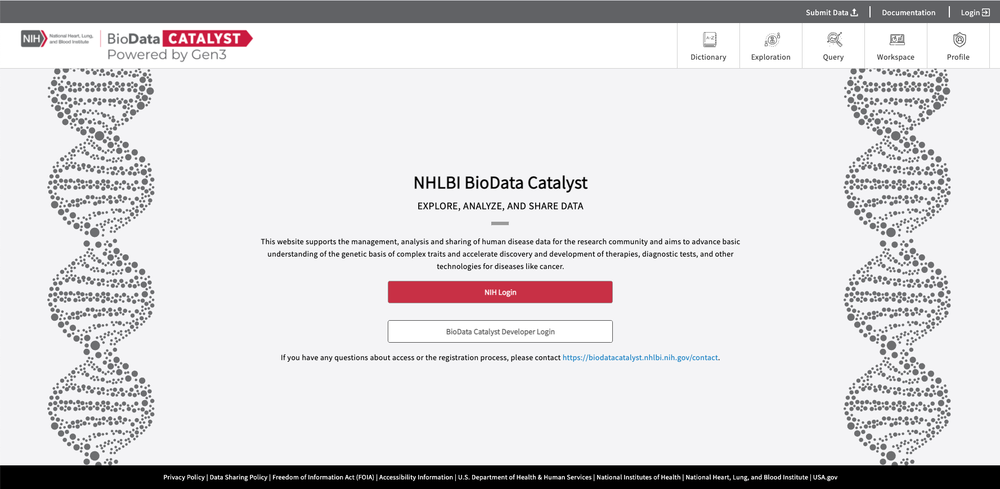
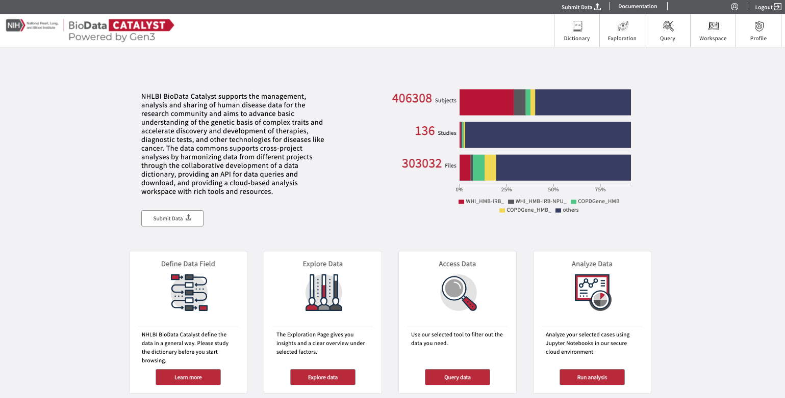
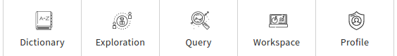

# Discovering Data Using Gen3

## Login to the _BDC-Gen3_ Platform 

In order to navigate and access data available on the Gen3 platform, start by visiting the [login page](https://gen3.biodatacatalyst.nhlbi.nih.gov/login). You will need an eRA Commons account as well as access permissions through the [Database of Genotypes and Phenotypes (dbGaP)](https://www.ncbi.nlm.nih.gov/gap/). If you are a researcher, login by selecting **NIH Login** and using your [eRA Commons account](https://public.era.nih.gov/commons/public/login.do). BDC consortia developers can login using their Google accounts. Make sure to use the correct login method that contains access to your available projects.

Once logged in, your username will appear in the upper right-hand corner of the page. You will also see a display with aggregate statistics for the total number of subjects, studies, aliquots and files available within the BDC platform.

> **NOTE**: These numbers may differ from those displayed in the dbGaP records as they include TOPMed studies as well as the associated parent studies.&#x20;

## Types of Hosted Data 

### Phenotypic 

#### DCC Harmonized clinical data:  

A number of clinical variables have been harmonized by the [Data Coordinating Center (DCC)](https://www.nhlbiwgs.org/group/dcc) in order to facilitate cross-study analysis. Faceted search over the DCC Harmonized Variables is available via the [Exploration](exploration.md) page, under the "Data" tab.

#### Unharmonized clinical data:  

Unharmonized clinical files are also available on the Gen3 platform and contain all of the raw phenotypic information for the hosted studies. Unlike the DCC Harmonized Variables, these files are located and searchable under the "[Files](exploration.md#the-files-tab)" tab in the [Exploration](exploration.md) page.

### Genomic 

The Gen3 platform hosts genomic data provided by the [Trans-Omics for Precision Medicine](https://www.nhlbiwgs.org/) (TOPMed) program and the [1000 Genomes Project](https://www.internationalgenome.org/) plus synthetic tutorial data from Terra. At present, these projects include CRAM and VCF files together with their respective index files. Specifically for TOPMed projects, each project will contain at least one multi-sample VCF that comprises all subjects within the consent group. CRAM and VCF are based on an individual level, whereas multi-sample VCFs are based on the study consent level.

All files are available under the "Files" tab in the [Exploration](exploration.md#the-files-tab) page. More detailed information on currently hosted data on the Gen3 platform can be found [here](parent-study-versus-topmed-study.md).

## Gen3 Pages 

The _BDC-Gen3_ platform contains five pages described below:

* [**Dictionary**](dictionary.md)**:** An interactive data dictionary display that details the contents and relationships between clinical and biospecimen data
* [**Exploration**](exploration.md)**:** The facet filter custom cohort creation tool
* [**Query**](query.md)**:** The GraphQL query tool to retrieve specific data within the graph model
* [**Workspace**](workspace.md)**:** The launch page for Gen3 workspaces that includes Jupyter Notebooks and RStudio
* [**Profile**](profile.md)**:** The information page for each user, displaying access and the location for credential file downloads

