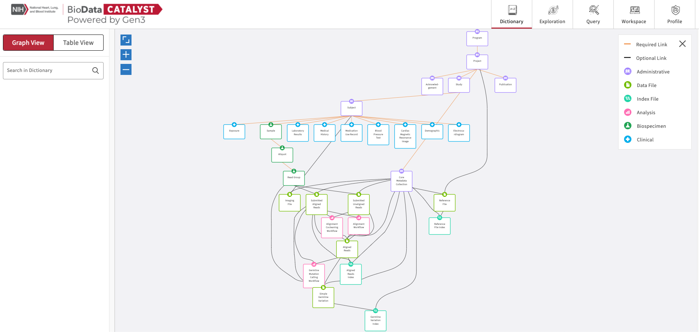
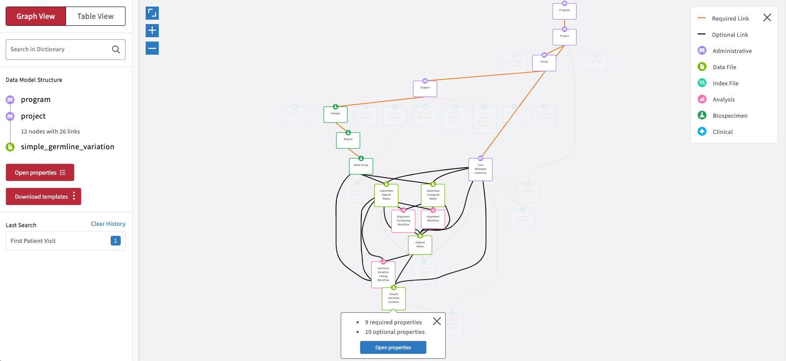
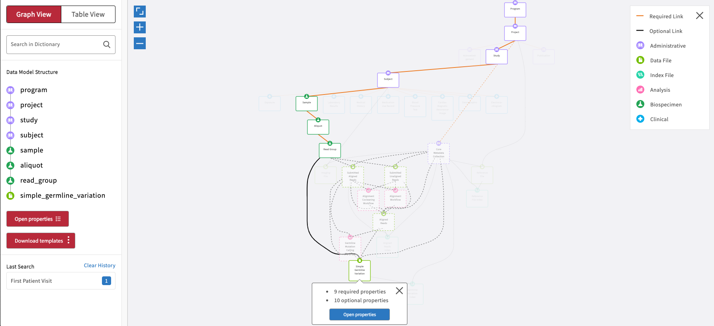
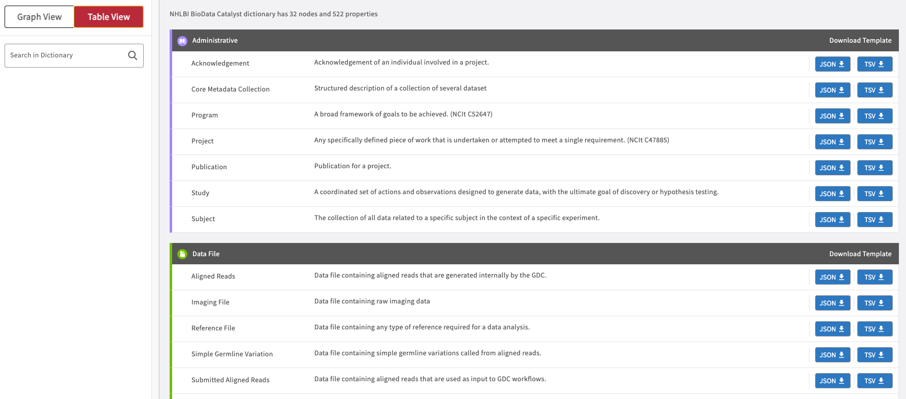
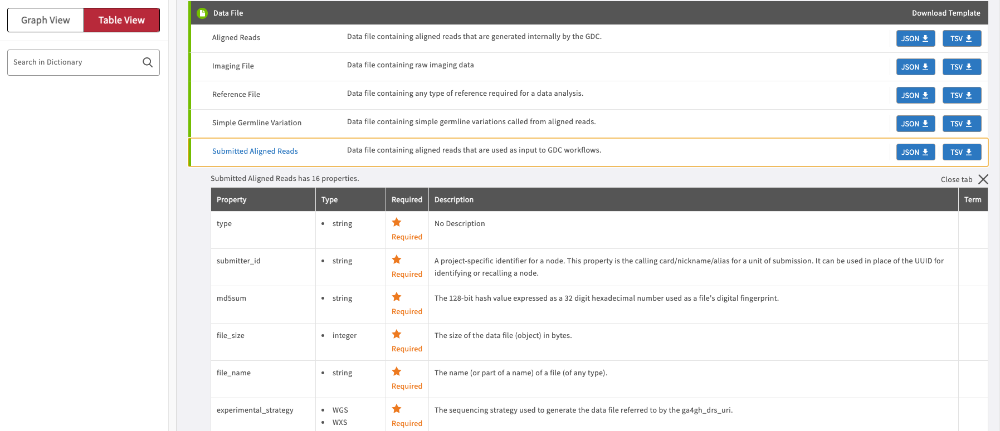
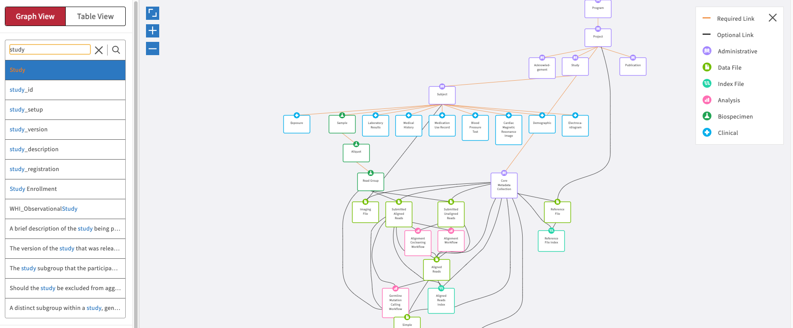
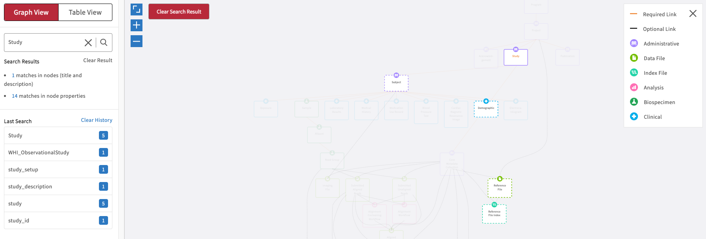
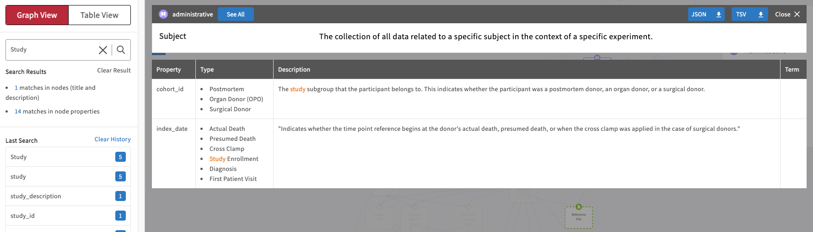
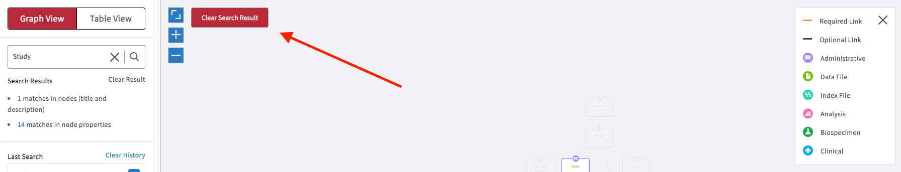

# Dictionary

## Overview

The **Dictionary** page contains an interactive visual representation of the Gen3 data model. The default graph model view, as pictured below, displays all of the nodes and relationships between nodes in a hierarchical structure. The model further specifies the node types and links between nodes, as highlighted in the legend located at the top right side of the page.

## Graph View

Users can click on any of the graph nodes in order to learn more about their respective properties. By clicking on a node, the graph will highlight that specific node and all associated links that connect it to the Program node. A "Data Model Structure" list will also appear on the left side toolbar. This will display the node path required to reach the selected node from the Program node.

When a second node in the path is selected, it will then gray out the other possible paths and only highlight the selected path. It will also change the "Data Model Structure" list on the left side toolbar.

The left side toolbar has two options available:&#x20;

* **Open properties**: Will download the submission files for all the nodes in the "Data Model Structure" list. This option can also be found on the node that was first selected.&#x20;
* **Download templates**: Will open the node properties in a new pop-up window; an example is displayed in the following screenshot.

.png>)

This property view will display all properties in the node and information about each property:

* **Property**: Name of the property.
* **Type**: The type of input for the node. Examples of this are `string`, `integer`, `Boolean` and enumerated values (`enum`), which are displayed as preset strings.
* **Required**: This field will display whether the property is required for the submission of the node into the data model.
* **Description**: This field will display further information about the property.
* **Term**: This field can be populated with external resources that have further information about the property.

## Table View

The **Table view** is similar to the Properties view, and nodes are displayed as a list of entries grouped by their node category.

Clicking on one of the nodes will open the Properties view of the node.

## Dictionary Search

The Dictionary contains a text-based search function that will search through the names of the properties and the descriptions. While typing, a list of suggestions appears below the search bar. Click on a suggestion to search for it.

When the search function is used, it will default to the graph model and highlight nodes that contain the search term. Frames around the node boxes indicate whether the searched word was identified in the name of the node (full line) or in the node's description and properties' names/descriptions (dashed line).&#x20;

Clicking on one of these nodes, it will only display the properties that have this keyword present in either the property name or the description.

Click **Clear Search Result** to clear the free text search if needed.

The search history is saved below the search bar in the "Last Search" list. Click on an item here to display the results again.&#x20;
