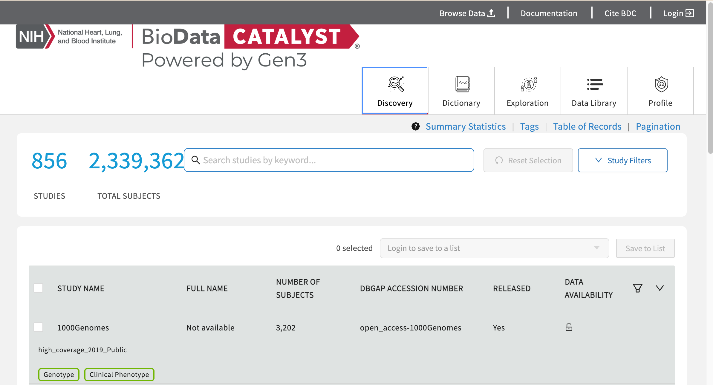
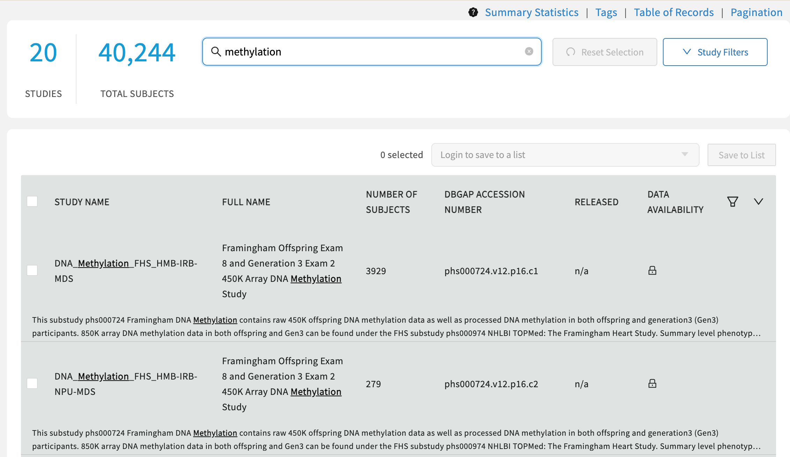
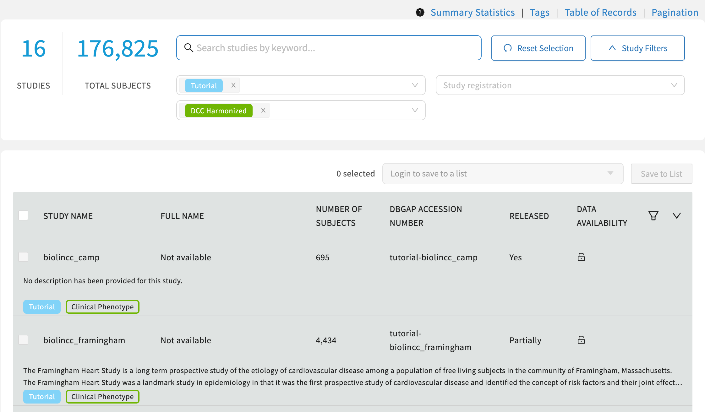
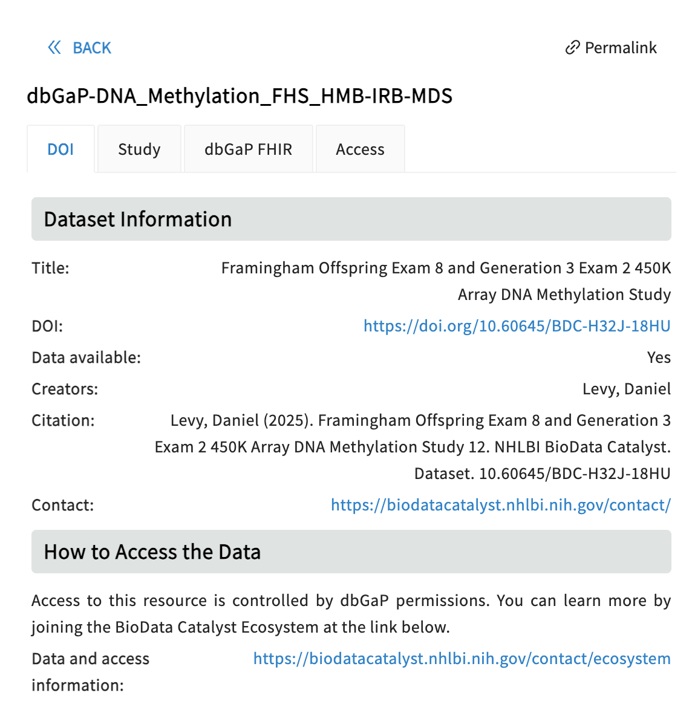

# Discovery

### Overview

The [Discovery Page](https://gen3.biodatacatalyst.nhlbi.nih.gov/discovery) provides users a venue to search and find studies and datasets available on the BDC-Gen3 platform.   This page is accessible to everyone.&#x20;

When navigating to this page researchers can see the current count of studies and subjects available on the platform.&#x20;

<figure><figcaption></figcaption></figure>

### Search Methods

Free-text searches can be used to identify relevant studies.  For example, entering 'methylation' in the search box currently shows twenty studies. &#x20;

<figure><figcaption></figcaption></figure>

Each row contains the platform study name, the full study name, number of subjects, and the dbGaP accession number.  The data availability field indicates whether the searcher has access to the data — a closed lock means 'no' and an open padlock means 'yes'. &#x20;

Search can also be conducted using 'filters' which are tags on each study record.  Expanding the "Study Filters" reveals the current search options and selections can be made from each pull down menu.

<figure><figcaption></figcaption></figure>

### Browsing a Study Record

From the table of results from a search, clicking on a STUDY NAME opens a linked page on the platform. &#x20;

<figure><figcaption></figcaption></figure>

Each tab contains additional study-level data about the study including the DOI for citation purposes, the full study description, and information retrieved from dbGaP
