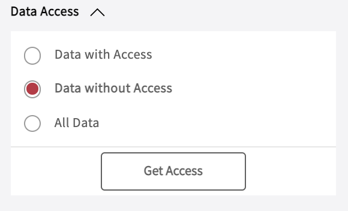
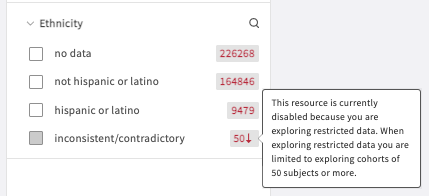
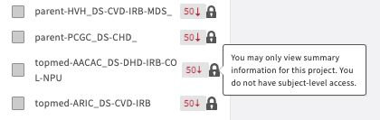
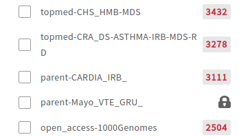
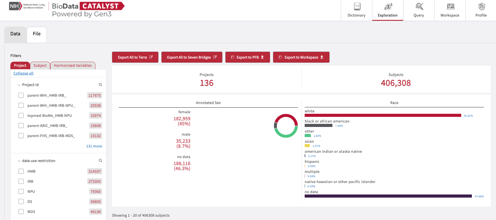
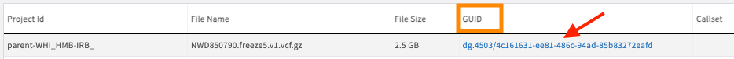
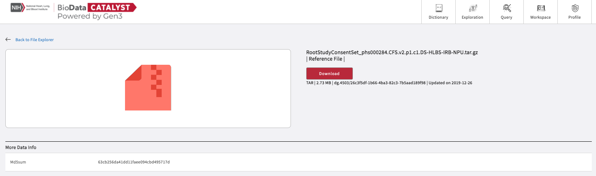
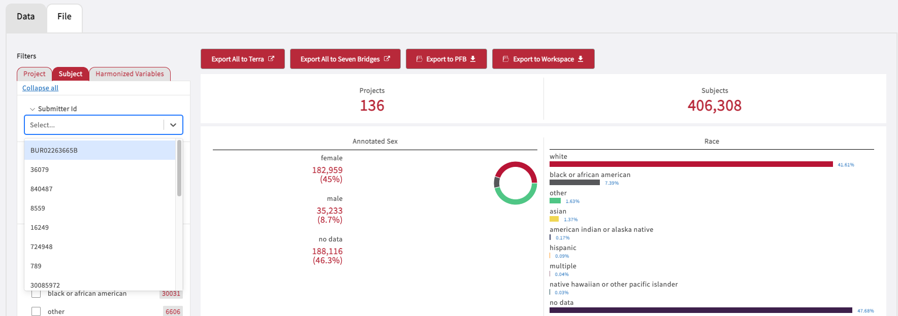
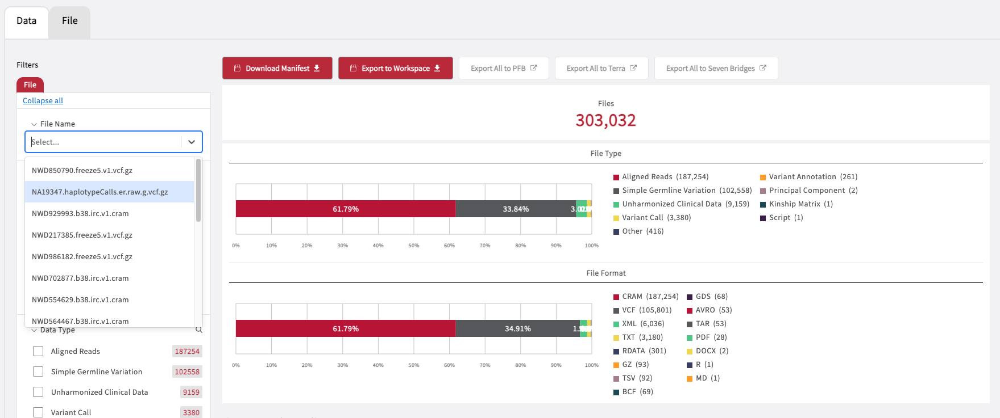
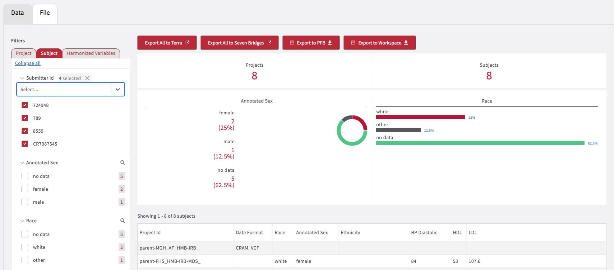

# Exploration

## Using Exploration

The **Exploration** page located in the upper right-hand section of the toolbar allows users to search through data and create cohorts. The Exploration portal contains a dynamic summary statistics display, as well as search facets leveraging the DCC Harmonized Variables.&#x20;

### Data Accessibility

Users can navigate through data on the Exploration page by selecting any of the three Data Access categories.

* **Data with Access**: A user can view all of the summary data and associated study information for studies the user has access to, including but not limited to Project ID, file types, and clinical variables.&#x20;
* **Data without Access**:&#x20;
  * Locks next to the project ID signify to users that they do not have subject-level access but they can still search through the available studies but only view summary statistics. Users can request access to data by visiting the [dbGaP homepage](https://dbgap.ncbi.nlm.nih.gov/). &#x20;
  * Projects will also be hidden if the select cohort contains fewer than 50 subjects (`50` ↓, "You may only view summary information for this project", example below); in this case grayed out boxes and locks both appear. An additional lock means users have no access.

* **All Data**: Users can view all of the data available in the _BDC-Gen3_ platform, including studies with and without access. As a result, studies not available to a user will be locked as demonstrated below.

By default, all users visiting the Exploration page will be assigned to `Data with Access`.

### The Data Tab

Under the "Data" tab, users can leverage the [DCC harmonized variables](https://chs-nhlbi.org/sites/chs-nhlbi.org/files/page/Stilp_topmed_pheno_harmonization_ccc_portland_2017-03-11.pdf) to create custom cohorts. When facets are selected and/or updated to cover a desired range of values, the display will reflect the information relevant to the new applied filter. If no facets have been selected, all of the data accessible to the user will be displayed. At this time, a user can filter based on three categories of clinical information:

* **Project**: Any specifically defined piece of work that is undertaken or attempted to meet a single investigative question or requirement.
* **Subject**: The collection of all data related to a specific subject in the context of a specific experiment.
* **Harmonized Variables**: A selection of different clinical properties from multiple nodes, defined by the Consortium.

> **NOTE**: The facet filters are based on the DCC Harmonized Variables, which are a selected subset of clinical data that have been transformed for compatibility across the dbGaP studies. TOPMed studies that do not contain harmonized clinical data at this time will be filtered out when a facet is chosen, unless the `no data` option is also selected for certain facets.

### Exporting Data from the Data Tab

After a cohort has been selected, the user has four different options for exporting the data.

#### Export

The options for export are as follows:

* `Export All to Terra` :  Initiate a [Portable Format for Bioinformatics (PFB)](pfb-files.md#what-is-a-portable-format-for-bioinformatics-pfb) export of all clinical data and file GUIDs for the selected cohort to [BioData Catalyst powered by Terra](https://terra.biodatacatalyst.nhlbi.nih.gov/). At this time the max number of subjects that can be exported to Terra is 120,000.
* `Export All to Seven Bridges`: Initiate a [Portable Format for Bioinformatics (PFB)](pfb-files.md#what-is-a-portable-format-for-bioinformatics-pfb) export of all clinical data and file GUIDs for the selected cohort to [BioData Catalyst powered by Seven Bridges. ](https://platform.sb.biodatacatalyst.nhlbi.nih.gov/)
* `Export to PFB` : Initiate a [PFB](./) export of all clinical data and file GUIDs for the selected cohort to your local storage.
* `Export to Workspaces` : Export a manifest to the user's workspace and make the case-associated data files available in the workspace under the `/pd/data` directory.

> **NOTE**: PFB export times can take up to 60 minutes, but often will complete in less than 10 minutes.&#x20;

### The Files Tab

.png>)

The Files tab displays study files from the facets chosen on the left-side panel (Project ID, Data Type, Data Format, Callset, and Bucket Path). Each time a facet selection is made, the data summary and displays will update to reflect the applied filters.

#### Locating Unharmonized Clinical Data

The Files tab also contains files that are either case-independent or project-level. This is important for files that are part of the `Unharmonized Clinical Data` category under the Data Type field. Unharmonized clinical files are made available in two distinct data formats:&#x20;

* `TAR` : Contain a complete directory of phenotypic datasets as `XML` and `TXT` files that are direct downloads of unharmonized clinical data from dbGaP on a study consent level project.&#x20;
* `AVRO`: These files are the same as the unharmonized clinical data from dbGaP as the `TAR` files, but in form of a [PFB](pfb-files.md#what-is-a-portable-format-for-bioinformatics-pfb) file.
* `XML`: These files contain either dictionary or variable reports of the phenotypic datasets that are in the TXT files. These supporting files do contain information on a study-level and _not_ on a subject-level.
* `TXT`: These files contain subject-level phenotypic datasets.

> **NOTE**: The unharmonized clinical data sets contains all data from the dbGaP study, but it is not cross-compatible across all studies within BDC.&#x20;

### Exporting/Downloading Data from the Files Tab

Once the user has selected a cohort, there are five options for accessing the files:&#x20;

* `Download Manifest`: Download the file manifest and use this manifest to download the enlisted data files using the [gen3-client](https://gen3.org/resources/user/gen3-client/).&#x20;
* `Export to Workspace`: The files can be exported to a Gen3 workspace.
* `Export All PFB`: Initiate a [PFB](./) export of the selected files.
* `Export All to Terra`: Initiate a [PFB](./) export of the selected files to [BioData Catalyst powered by Terra](https://terra.biodatacatalyst.nhlbi.nih.gov/).&#x20;
* `Export All to Seven Bridges`: Initiate a [PFB](./) export of the selected files to [BioData Catalyst powered by Seven Bridges. ](https://platform.sb.biodatacatalyst.nhlbi.nih.gov/)
* `GUID Download File Page`:  Aside from the 5 button options, users can download files by first clicking on the link(s) under the GUIDs column, followed by the Download button in the file information pages (see next section below).

### File Information Page

A user can visit the File Information Page after clicking on any of the available GUID link(s) in the Files tab page. The page will display details such as data format, size, object\_id, the last time it was updated and the md5sum. The page also contains a button to download the file via the browser (see below). For files that are 5GB or more, we suggest using the [gen3-client](https://gen3.org/resources/user/gen3-client/).

### Free text search for Submitter IDs and File Names

Both the Data and File tabs contain a text-based search function that will initiate a list of suggestions below the search bar while typing.

In the **Data** tab, Submitter IDs can be searched under the `Subject` tab.&#x20;

In the **File** tab, File Names can be searched under the `File` tab.&#x20;

Click either on a single or on multiple suggestions in the list appearing underneath the search bar to create a cohort and export/download the data. The selections can be again clicked to be removed from the created cohort.&#x20;

