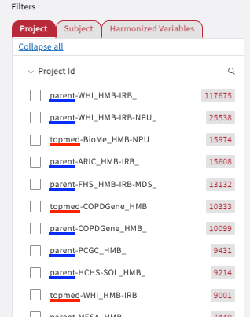

# Current Projects

## Current Project IDs

A list of **current project IDs** can be found in the Data tab, under Filters>Project>Project Id. The current project IDs are:

* Parent
* TOPMed&#x20;
* Open\_Access
* Tutorial

.png>)

## Parent and TOPMed Studies

### Distinguishing Between Parent and TOPMed Studies

The Parent and TOPMed study types have been categorized on Gen3 by their Program designation. An example of this designation by Program is presented below.

The Program types can be further identified by whether there is an underscore (`_`) at the end of the study:

* Parent studies **will** include an underscore at the end of the study name.&#x20;
  * Example: `parent-WHI_HMB-IRB_`
* TOPMed studies **will not** include an underscore at the end of the study name.&#x20;
  * Example: `topmed-BioMe_HMB-NPU`

### Relationship Between Parent and TOPMed Studies

There are three distinct relationships possible between Parent and TOPMed studies. The first two relationships are streamlined:&#x20;

* **Parent only**: The Parent study does not have a TOPMed counterpart study. This usually means that there are no genomic data, such as WXS (whole exome sequencing) or WGS (whole genome sequencing), located within the study; only phenotypic data.
* **TOPMed only**: This TOPMed study does not have a Parent counterpart study. These studies will contain both genomic data, WXS or WGS, and phenotypic data.
* **Parent study with a counterpart TOPMed study**: The Parent study will contain the phenotypic data, while the TOPMEd study will contain the genomic data. Under dbGaP, these studies would be kept separate from one another and the user would need to create the linkages. In the Gen3 platform, these studies have been linked together under the Parent study, based on the participant IDs found in dbGaP. This allows our system to produce valuable information and cohort creation as it combines both phenotypic and genomic data.

### Parent and TOPMed Study Contents

The most notable difference between the Program categories is the type of hosted data.

#### **Parent**

* Genomic data: None
* Phenotypic data: Like with TOPMed studies, any phenotypic data found within the Graph Model, will only be DCC harmonized variables. For the raw phenotypic data from dbGaP, again, it can be found in the `reference_file` node.

#### **TOPMed**

* Genomic data: Available data can include CRAM, VCFs and Cohort-level VCF files
* Phenotypic data: TOPMed studies without an associated Parent study will include phenotypic data in the data graph by way of DCC harmonized variables. Additionally, raw phenotypic data from dbGaP can be found in the `reference_file` as tar files that share this common naming scheme: `RootStudyConsentSet_phs######.<study_shorthand>.v#.p#.c#.<consent_codes>.tar.gz`

## Open\_Access - 1000 Genomes project

The **1000 Genomes Project** is an international research effort (2008-2015) to establish the most detailed catalogue of human variation and genotype data. On the Gen3 platform, the Program **open\_access** contains:

* Genotypic data: Available data can include CRAM and VCF files.
* Phenotypic data: The data graph will contain phenotypic data by way of DCC harmonized variables. Additionally, raw phenotypic data can be found in the `reference_file` as VCF and TXT files.

## Tutorial

This program contains genomic data from 1000 Genomes and synthetic clinical data generated by Terra. Purpose of this dataset is to use it as a genome-wide association study (GWAS) tutorial. GWAS is an approach used in genetics research to associate specific genetic variations with particular diseases. For more information, see [Terra Tutorials](https://bdcatalyst.gitbook.io/biodata-catalyst-documentation/tutorials-videos-and-modules/terra-tutorials).

On the Gen3 platform, the Program **tutorial** contains:

* Genotypic data: Available data can include CRAM and VCF files.
* Phenotypic data: The data graph will contain phenotypic data by way of DCC harmonized variables. Additionally, raw phenotypic data can be found in the `reference_file` as VCF and GDS files.
