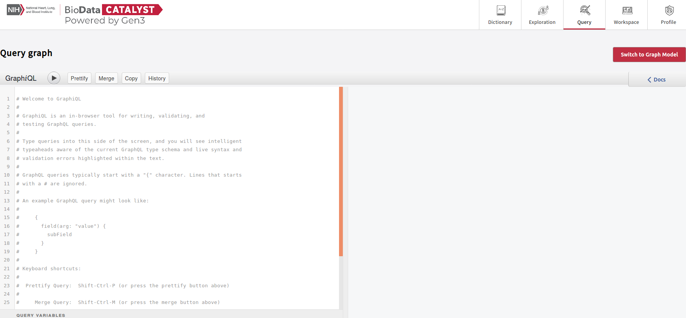

# Query

## Overview

The **Query** page can search and return metadata from either the Flat Model or the Graph Model of a commons. Using GraphQL, these searches can be tailored to filter and return fields of interest for the data sets being queried. These queries can be made immediately after data submission as this queries the model directly.

For more information about how to use the Query page, refer to the [Gen3 documentation](https://gen3.org/resources/user/query-data/).

