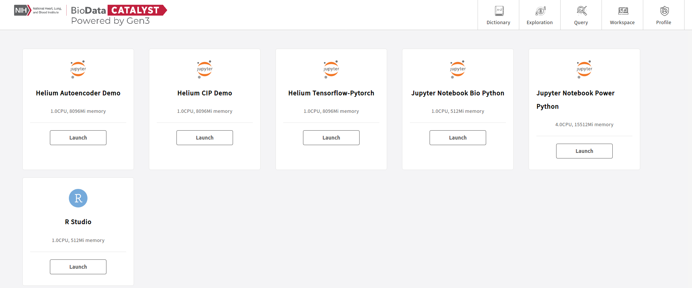
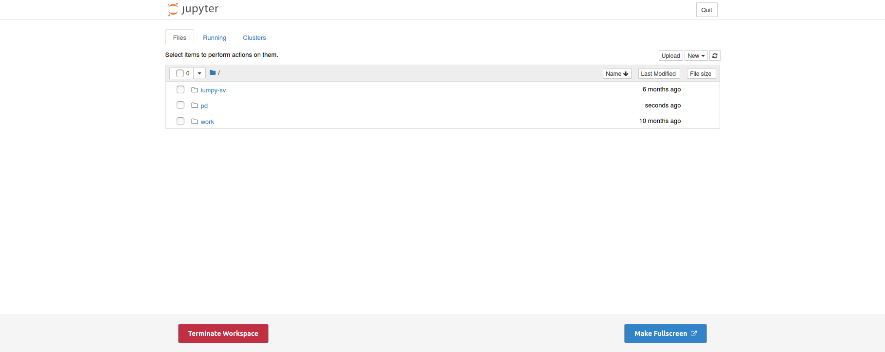
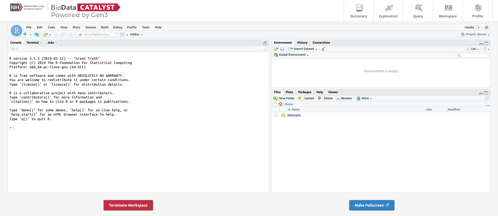

# Workspace

When navigating to a Workspace, users are presented with multiple workspace options.

The Gen3 platform offers two workspace environments: Jupyter Notebooks and R Studio.&#x20;

There are six workspaces:

**Virtual machines (VM):**&#x20;

* Small Jupyter Notebook VM
* Large Jupyter Notebook Power VM
* R Studio VM

**Pre-made workflow workspaces:**&#x20;

* Autoencoder Demo
* CIP Demo
* Tensorflow-Pytorch.&#x20;

To start a workspace, select **Launch**. You will see the following launch loading screen.


Launching a VM can take up to five minutes depending on the size and complexity of the workspace.


Once the VM is ready, the initial screen for the workspace will appear. For scripts and output that need to be saved when the workspace is terminated, store those files in the `pd/` directory.&#x20;

This workspace will persist once the user has logged out of the _BDC-Gen3_ system. If the workspace is no longer being used, terminate the workspace by selecting **Terminate Workspace** at the bottom of the window. You will be returned to the Workspace page with all of the workspace options.&#x20;

For more information about the Gen3 Workspace, refer to [Data Analysis in a Gen3 Data Commons](https://gen3.org/resources/user/analyze-data/).
