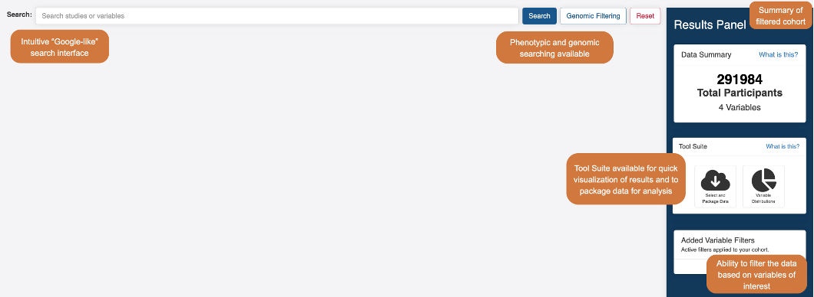

# PIC-SURE User Guide

The **Patient Information Commons: Standard Unification of Research Elements** (PIC-SURE) integrates clinical and genomic data to allow users to search, query, and export data at the variable and variant levels. This allows users to create analysis-ready data frames without manually mapping and merging files.

_BDC Powered by PIC-SURE (BDC-PIC-SURE)_ functions as part of the BDC ecosystem, allowing researchers to explore studies funded by the National Heart, Lung, and Blood Institute (NHLBI), whether they have been granted access to the participant level data or not.

<figure><figcaption>
Overview of PIC-SURE search interface
</figcaption></figure>
