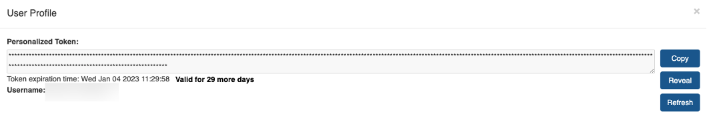
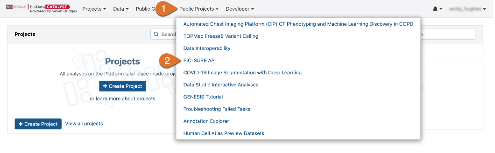
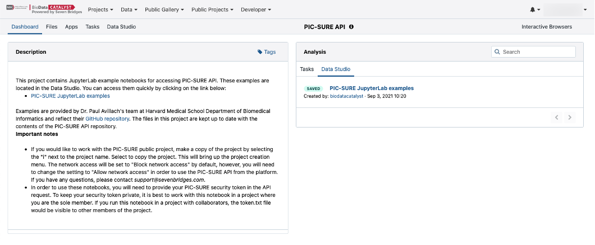
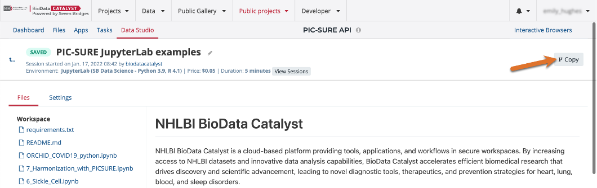
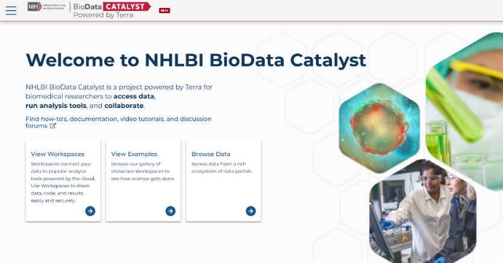
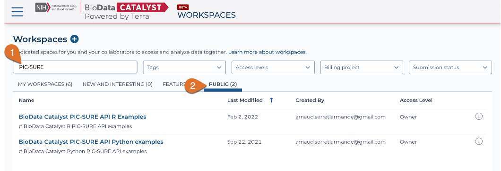

# Data Analysis Using the PIC-SURE API

## **What is the PIC-SURE API?**

Databases exposed through the PIC-SURE API encompass a wide heterogeneity of architectures and data organizations underneath. PIC-SURE hides this complexity and exposes the different databases in the same format, allowing researchers to focus on the analysis and medical insights, thus easing the process of reproducible sciences. The API is available in two different programming languages, python and R, allowing investigators to query databases in the same way using either of those languages. The PIC-SURE API tutorial notebooks can be directly accessed on [GitHub](https://github.com/hms-dbmi/Access-to-Data-using-PIC-SURE-API/tree/master/NHLBI_BioData_Catalyst).

## PIC-SURE Access Token

To access the PIC-SURE API, a user-specific token is needed. This is the way the API grants access to individual users to protected-access data. The user token is strictly personal; do not share it with anyone. You can copy your personalized access token by selecting the **User Profile** tab at the top of the screen.

Here, you can **Copy** your personalized access token, **Reveal** your token, and **Refresh** your token to retrieve a new token and deactivate the old token.

<figure><figcaption>
User Profile modal displaying personalized access token.
</figcaption></figure>

## **Analysis in the BDC Ecosystem**

The PIC-SURE API can be accessed via tutorial notebooks on either _BDC-_[_Seven Bridges_](https://platform.sb.biodatacatalyst.nhlbi.nih.gov/) or _BDC-_[_Terra_](https://terra.biodatacatalyst.nhlbi.nih.gov/).

To launch one of the analysis platforms, go to the [BioData Catalyst website](https://biodatacatalyst.nhlbi.nih.gov/). From the **Resources** menu, select **Services.** A list of platforms and services on the BDC ecosystem will be displayed.

From the **Analyze Data in Cloud-based Shared Workspaces** section, select **Launch** for your preferred analysis platform.

### _**BDC-Seven Bridges**_

Jupyter notebook examples in R and python can be found under the **Public projects** tab by selecting **PIC-SURE API**.&#x20;

<figure><figcaption>
Navigating to the <strong>PIC-SURE API</strong> in Seven Bridges <strong>Public Projects</strong>.
</figcaption></figure>

From the **Data Studio** tab, select an example that fits your research needs. Here, we will select **PIC-SURE JupyterLab examples**.

<figure><figcaption>
Dashboard of the <strong>PIC-SURE API</strong> on Seven Bridges
</figcaption></figure>

This will take you to the PIC-SURE API analysis workspace, where you can view the examples in python. Copy this workspace to your own project to edit or run the code yourself.

<figure><figcaption>
Copying the <strong>PIC-SURE API</strong> Public Project to a workspace from the Data Studio page.
</figcaption></figure>


**Note**\
The project must have network access to run the PIC-SURE examples on Seven Bridges. To ensure this, go to the Settings tab and select “Allow network access”.


### _**BDC-Terra**_

To access the Jupyter notebook examples in R and python for the PIC-SURE API, select **View Workspaces** from the [Terra landing page](https://terra.biodatacatalyst.nhlbi.nih.gov/). &#x20;

Select the **Public** tab and search for “PIC-SURE”. Workspaces for both the python and R examples will be displayed. You must clone the workspaces to edit or run the code within them.

<figure><figcaption>
Searching for the PIC-SURE API examples in Terra workspaces
</figcaption></figure>
