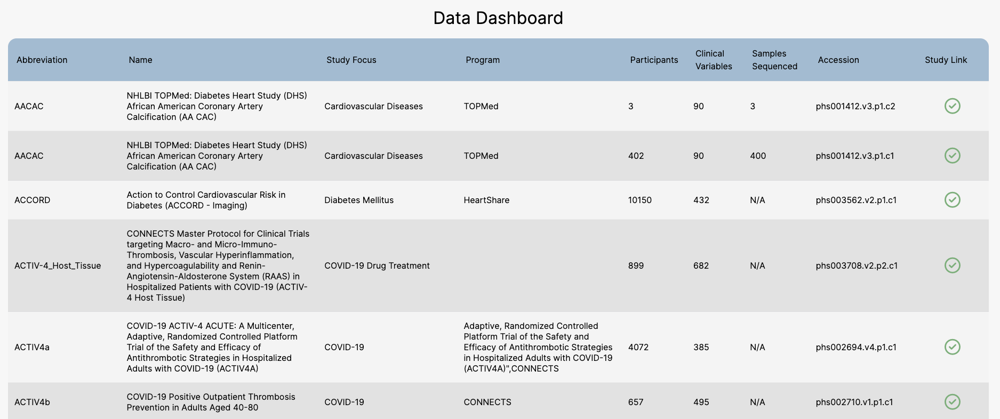

# Available Data & Managing Data Access

_BDC-PIC-SURE_ has integrated clinical and genomic data from various heart, lung, blood, and sleep-related datasets. These include the NHLBI Trans-Omics for Precision Medicine (TOPMed) and TOPMed-related studies, BioLINCC datasets, and COVID-19 datasets.

View a summary of the data available in BDC and the data you have access to by viewing the [Data Dashboard](https://picsure.biodatacatalyst.nhlbi.nih.gov/dashboard). This table displays information about the study and associated data, including the full and abbreviated name of the study, study focus, associated program, the number of clinical variables, participants, and samples sequenced, and the dbGaP accession number (or phs number).


The Data Dashboard displays some studies that are available in AnVIL (NHGRI Analysis Visualization and Informatics Lab-space). These studies may not be available in BDC. Please review the [AnVIL Studies](https://anvilproject.org/data/studies) and documentation to learn how to access these datasets.


You are also able to see which studies you are authorized to access if you are logged in using the **Study Link** column of the table.

<figure><figcaption>
Data Dashboard on BioData Catalyst Powered by PIC-SURE.
</figcaption></figure>

For information from dbGaP on submitting a data access request, refer to [Tips for Preparing a Successful Data Access Request documentation](https://www.ncbi.nlm.nih.gov/projects/gap/cgi-bin/GetPdf.cgi?document_name=GeneralAAInstructions.pdf).
