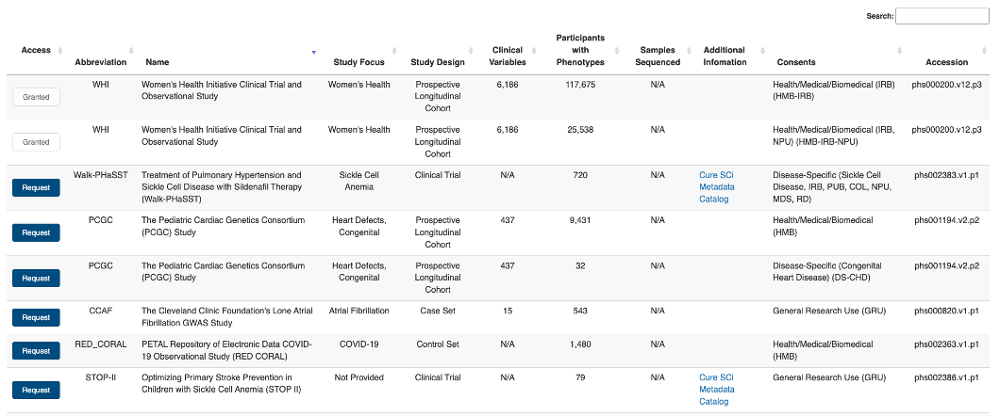

# Available Data and Managing Data Access

_BDC-PIC-SURE_ has integrated clinical and genomic data from a variety of heart, lung, blood, and sleep related datasets. These include NHLBI Trans-Omics for Precision Medicine (TOPMed) and TOPMed related studies, BioLINCC datasets, and COVID-19 datasets.

View a summary of the data you have access to by viewing the **Data Access Table**.

This table displays information about the study and associated data, including the full and abbreviated name of the study, study design and focus, the number of clinical variables, participants, and samples sequenced, additional information with helpful links, consent group information, and the dbGaP accession number (or phs number). You are also able to see which studies you are authorized to access in the **Access** column of the table. For information from dbGaP on submitting a data access request, refer to [Tips for Preparing a Successful Data Access Request documentation](https://www.ncbi.nlm.nih.gov/projects/gap/cgi-bin/GetPdf.cgi?document_name=GeneralAAInstructions.pdf). Note that studies with a sickle cell disease focus contain links to the [Cure SCi Metadata Catalog](https://curesicklecell.rti.org/) for additional information.

<figure><figcaption>
Sample summary table of studies available and user-based authorization via the Data Table.
</figcaption></figure>

You can also check the data you have access to by going to the [BioData Catalyst Data Access](https://biodatacatalyst.nhlbi.nih.gov/use-bdc/explore-data) page on the BDC website and clicking **Check My Access**.

<figure><figcaption>
“Check my access” on the BDC Access page.
</figcaption></figure>

