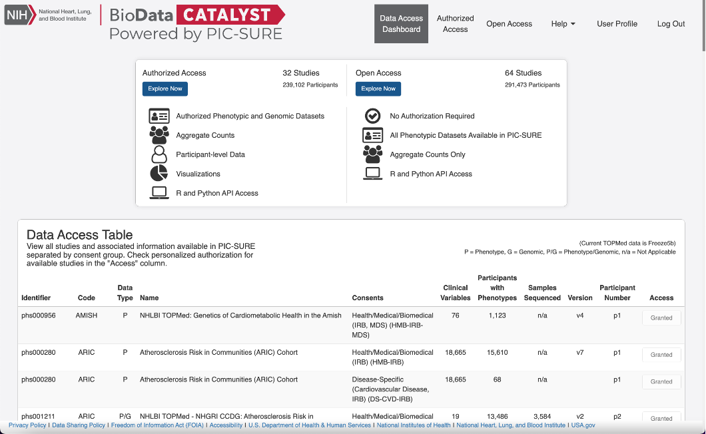

# Requirements and Login

## Requirements

To obtain access to _BDC-PIC-SURE_, you must have an NIH eRA Commons account. For instructions and to register an account, refer to the [eRA website](https://www.era.nih.gov/register-accounts/register-in-era-commons.htm).

## Login

After you have created an eRA Commons account, you can log in to _BDC-PIC-SURE_ by navigating to [https://picsure.biodatacatalyst.nhlbi.nih.gov](https://picsure.biodatacatalyst.nhlbi.nih.gov/) and selecting to log in **with eRA Commons**. You will be directed to the NIH website to log in with your eRA Commons credentials. After signing in and accepting the terms of the agreement on the NIH RAS Information Sharing Consent page, allow the _BDC-Gen3_ service to manage your authorization.

Upon login, you will be directed to the **Data Access Dashboard**. This page provides a summary of PIC-SURE Authorized Access, PIC-SURE Open Access, and the studies you are authorized to access.

<figure><figcaption>
PIC-SURE Data Access Dashboard
</figcaption></figure>

##
