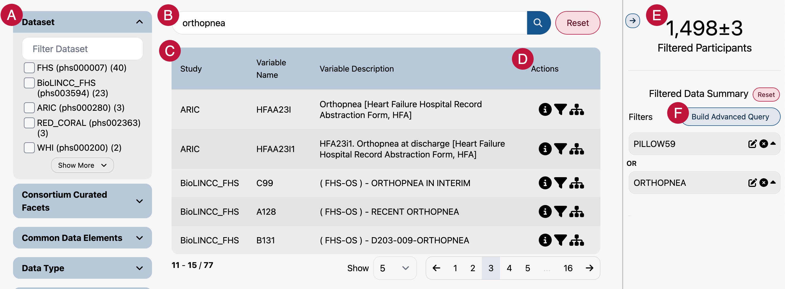

# Features of Discover

The Discover page allows you to search any clinical variable available in PIC-SURE. Queries will return obfuscated aggregate counts per study and consent. There are some features specific to the Discover page, which are outlined below.

<figure><figcaption>
Specific features and layout of Discover.
</figcaption></figure>

**A: Faceted search.** The panel on the left-hand side of the screen provides options, or facets, to narrow down your search results.

**B: Search bar.** The search bar at the top center of the page allows for searching of phenotypes, clinical outcomes, and variables of interest.

**C. Search results table.** The search results table displays the variables that are returned based on the combination of search term and selected facets.

**D. Actions for filtering variables.** Information about icons from left to right:

* The Information icon allows you to view information associated with the variable.
* The Filter icon allows you to apply a variable-level filter.
* The Hierarchy icon allows you to apply filters on different nodes within that variable's concept path. For example, let's say we click the hierarchy icon of the `HFAA23I1. Orthopnea at discharge [Heart Failure Hospital Record Abstraction Form, HFA]` variable. This will show the concept path for the variable: the study (ARIC), table (pht004102), and variable level. We can click on the table "pht004102" level to add a filter that selects participants with data associated with any variables in that table.


**Some variables are not filterable to protect participant data.**

Discover does not allow the filtering of clinical variables that contain potentially sensitive information. These variables are known as stigmatizing variables, which fall into the following categories:

* Mental health diagnoses, history, and treatment
* Illicit drug use history
* Sexually transmitted disease diagnoses, history, and treatment
* Sexual history
* Intellectual achievement, ability, and educational attainment

For more information about stigmatizing variables and the identification process, please refer to the documentation and code on the [_BioData Catalyst Powered by PIC-SURE_ Stigmatizing Variables GitHub repository](https://github.com/hms-dbmi/biodata_catalyst_stigmatizing_variables).

Some additional variables are not filterable to protect participant anonymity. You can submit a request for our team to review a variable's status using [our helpdesk](https://hms-dbmi.atlassian.net/servicedesk/customer/portal/14/group/26/create/156).


**E. Participant counts in the Results Panel.** The count displayed will be updated to describe the number of participants who meet the query criteria. Because participant-level data are not available in Discover, the aggregate counts are obfuscated to ensure data anonymity. This means that:

* If the participant count is between zero and nine, it will be shown as < 10.
* If the participant count is ten or greater, the true count will be shown.
* If the participant count is ten or greater, but the count consists of subgroups (such as consent groups) that are between zero and nine, the count will be obfuscated by +/- 3.

**F. Build Advanced Query.** Enables researchers to create complex queries by defining logical operators ("and" vs. "or") and grouping related filters. For more information, please refer to the [Building Advanced Queries section](../building-advanced-queries.md).
