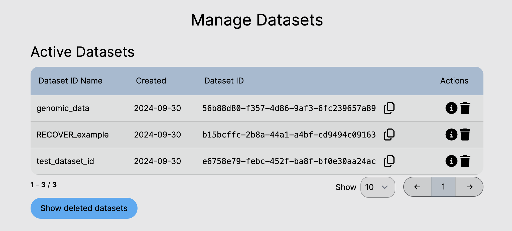

# Manage Datasets

The API page of the PIC-SURE interface provides a table overview of previously saved dataset IDs.

<figure><figcaption>
Manage Datasets table with previously saved datasets.
</figcaption></figure>

There are several actions available to manage the saved dataset IDs:

* **Copy** can be used to copy the dataset ID to the clipboard.
* **More information** can be used to view the details associated with the dataset ID, such as variable filters and variables added to export.
* **Delete** can be used to remove unwanted dataset IDs from the table. Note that deleted dataset IDs can be restored.

To view previously deleted dataset IDs, click the "Include Deleted Dataset IDs" button to display a new table with these IDs.
