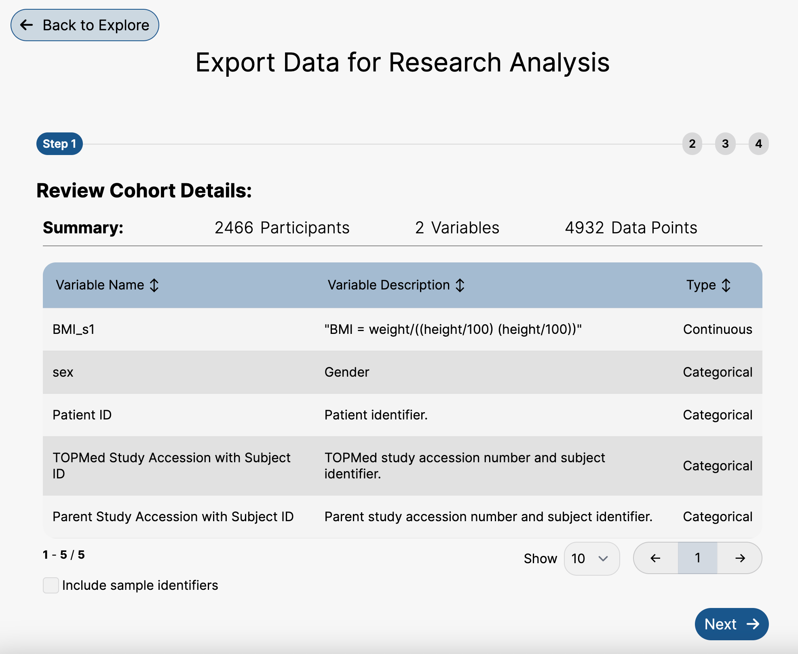
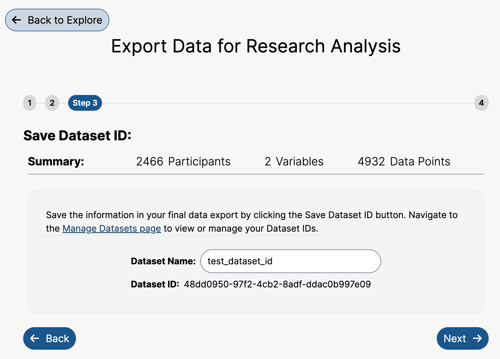

# Prepare for Analysis

Prepare for Analysis is used to export participant-level data corresponding to your filters and variable selections. There are several steps to export the data, which are shown using this process.

## Step 1: Review Cohort Details

The first step of the process is to review your cohort details. This provides a tabular summary of the variables that have been filtered and added.

Below the summary is an option to include sample identifiers in the export. This will allow you to connect the phenotypic data you have selected to the sample data associated with the participant. By checking the box, the sample identifier information will be added to your export if the selected participants have sample information available.

<figure><figcaption>
Step 1: Review cohort details with the option to include sample identifiers.
</figcaption></figure>


Note: Queries with more than 1,000,000 data points will not be exportable.


## Step 2: Select Export Type

To complete the export, the user will need to decide what format they would like their participant-level data to be in. There are three options: Export as Data Frame or CSV, Export as Timeseries, or Export as PFB. For more detailed information about these data formats, please refer to [Format of Participant-Level Data](https://github.com/emhug/bdc-docs/blob/main/introduction-to-pic-sure/explore-authorized-cohort-building/prepare-for-analysis/format-of-participant-level-data.md).

<figure><figcaption>
Step 2: Select export format.
</figcaption></figure>

### Export as Data Frame or CSV

The Export as Data Frame or CSV option should be selected if you are interested in exporting your selected data as a Comma-Separated Values file or if you intend to complete your export using the PIC-SURE API via R or Python. This includes using Juptyer Notebooks or RStudio to export your data to BioData Catalyst Powered by Seven Bridges or BioData Catalyst Powered by Terra. For more information about using the PIC-SURE API for export, please refer to the [Data Analysis Using the PIC-SURE API section](https://github.com/emhug/bdc-docs/blob/main/broken/pages/FwbLqWRn5zoDBxYRnmF5).

In some instances, multiple values may relate to a single variable per participant. For example, some participants may have had several samples sequenced, resulting in many sample identifiers for a single participant. If there are multiple values for a given variable, these values will be separated by a tab or `\t` character.

### Export as Timeseries

The Export as Timeseries option should be selected if you created a cohort with data that contains timestamps. This includes data types like electronic health record (EHR) data.

### Export as PFB

The Export as PFB option should be selected if you are interested in exporting your selected data as a Portable Format for Biomedical Data file or if you intend to send your data to a BioData Catalyst analysis platform. For more information about this, please refer to [PFB Handoff to BioData Catalyst Powered by Terra](https://github.com/emhug/bdc-docs/blob/main/introduction-to-pic-sure/explore-authorized-cohort-building/prepare-for-analysis/pfb-handoff-to-biodata-catalyst-powered-by-terra.md) or [PFB Handoff to BioData Catalyst Powered by Seven Bridges](https://github.com/emhug/bdc-docs/blob/main/introduction-to-pic-sure/explore-authorized-cohort-building/prepare-for-analysis/pfb-handoff-to-biodata-catalyst-powered-by-seven-bridges.md).

## Step 3: Save Dataset ID

The next step is to save the dataset ID. The dataset ID is the unique identifier that is created for the specific query you have created. Type a name for the dataset ID into the field in order to save the dataset ID for future reference. For more information about accessing and managing previously saved dataset IDs, please refer to the [Manage Datasets section](https://github.com/emhug/bdc-docs/blob/main/introduction-to-pic-sure/explore-authorized-cohort-building/manage-datasets.md).

<figure><figcaption>
Step 3: Save dataset ID step, showing a dataset ID named as "test_dataset_id".
</figcaption></figure>

## Step 4: Export Data

The data is now ready for export. Based on your export format selection, there will be options displayed for export.

If you chose **Export as Data Frame or CSV** or **Export as Timeseries**, the code to complete this export into a data frame in Python or R is provided. Additionally, the file can be downloaded as a CSV file.

If you chose **Export as PFB**, you have the option to export the file into a Terra workspace or a Seven Bridges project. Clicking either of these options will automatically put the file into the location of your choosing. For more information, please refer to [PFB Handoff to BioData Catalyst Powered by Terra](https://github.com/emhug/bdc-docs/blob/main/introduction-to-pic-sure/explore-authorized-cohort-building/prepare-for-analysis/pfb-handoff-to-biodata-catalyst-powered-by-terra.md) or [PFB Handoff to BioData Catalyst Powered by Seven Bridges](https://github.com/emhug/bdc-docs/blob/main/introduction-to-pic-sure/explore-authorized-cohort-building/prepare-for-analysis/pfb-handoff-to-biodata-catalyst-powered-by-seven-bridges.md).
