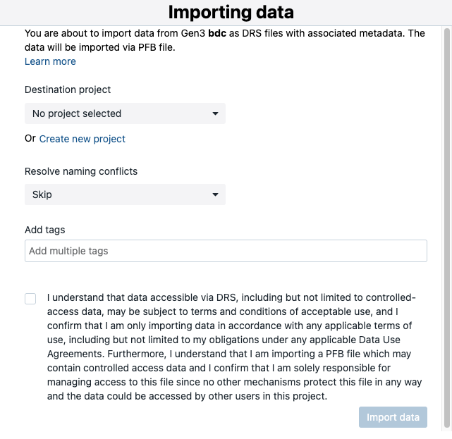
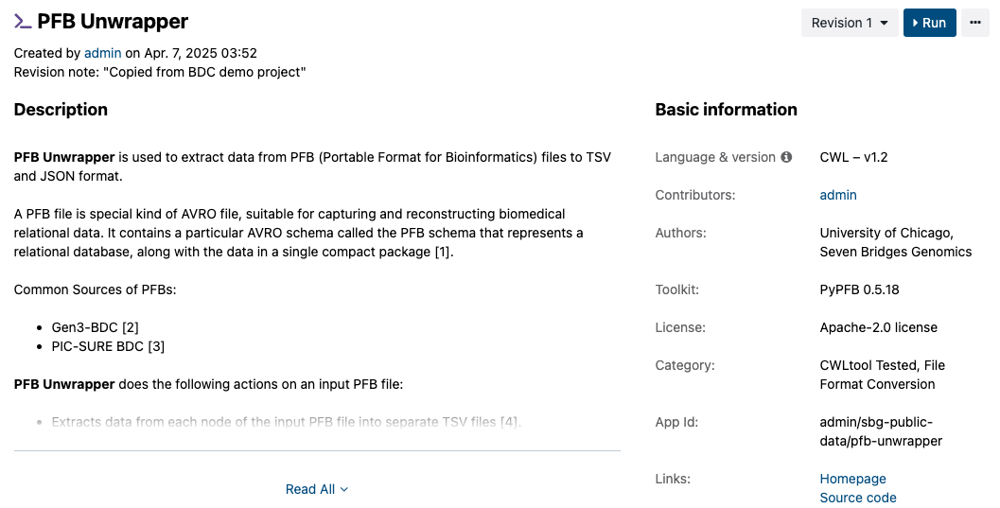

# PFB Handoff of BioData Catalyst Powered by Seven Bridges

The selected participant-level data from PIC-SURE can be handed off to Seven Bridges for analysis in the Portable Format for Bioinformatics, or PFB.

To learn more about the PFB format, please refer to the PFB documentation: [https://uc-cdis.github.io/pypfb/](https://uc-cdis.github.io/pypfb/)

***

## Prepare Data for Analysis from PIC-SURE

Once you have selected the cohort and data of interest, the data should be prepared for analysis. During this process, be sure to select the "Export as PFB" option. For more information on how to prepare the data for analysis, please refer to Prepare for Analysis.

After going through the process, select the "Export to Seven Bridges" option. This will direct you to the Seven Bridges platform.

<figure><figcaption>
After preparing the data for analysis in PFB format, "Export to Seven Bridges" can be used to handoff the data to BioData Catalyst Powered by Seven Bridges for analysis. 
</figcaption></figure>

## Exporting to Seven Bridges

Selecting "Export to Seven Bridges" will direct you to BioData Catalyst Powered by Seven Bridges in a new tab. You may be required to sign in to Seven Bridges.

Select the preferred destination of the data in Seven Bridges. This can be an existing project created previously or a new one. Follow the steps to choose the location.

<figure><figcaption>
Before handing off the data, select the preferred destination of the data in Seven Bridges.
</figcaption></figure>

Once the selection has been made, follow the prompts to go to the destination project, where the file will be loaded.

## Data Format in Seven Bridges Project

The data will be stored as an Avro file in your project. You can find this file by navigating to the "Files" tab of your destination project.


Note: You can disregard error messages related to DRS URIs and importing from Gen3. To check if your data was handed off, go to the project and unpack the Avro file.


You can unpack the Avro file using the [PFB Unwrapper App in the "Public Apps" section](https://platform.sb.biodatacatalyst.nhlbi.nih.gov/public/apps/admin/sbg-public-data/pfb-unwrapper).

<figure><figcaption>
BioData Catalyst Powered by Seven Bridges has a publicly available PFB Unwrapper app.
</figcaption></figure>

Once unpacked, there will be two main data tables: the data and the data dictionary tables.
