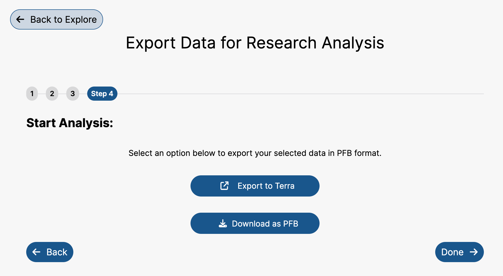
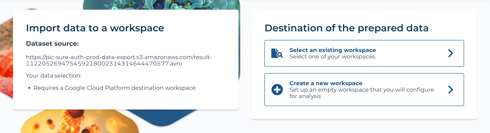
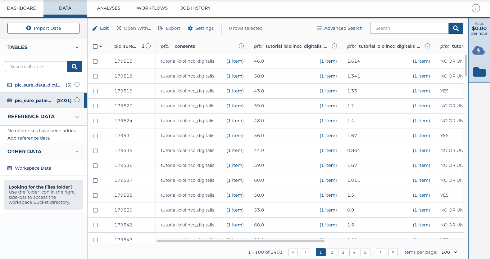
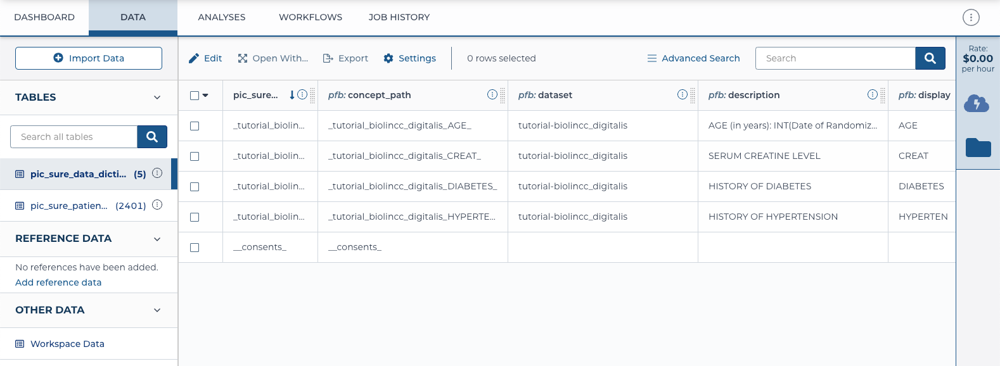

# PFB Handoff to BioData Catalyst Powered by Terra

The selected participant-level data from PIC-SURE can be handed off to Terra for analysis in the Portable Format for Bioinformatics, or PFB.

To learn more about the PFB format, please refer to the PFB documentation: [https://uc-cdis.github.io/pypfb/](https://uc-cdis.github.io/pypfb/)

***

## Prepare Data for Analysis from PIC-SURE

Once you have selected the cohort and data of interest, the data should be prepared for analysis. During this process, be sure to select the "Export as PFB" option. For more information on how to prepare the data for analysis, please refer to Prepare for Analysis.

After going through the process, select the "Export to Terra" option. This will direct you to the Terra platform.

<figure><figcaption>
After preparing the data for analysis in PFB format, "Export to Terra" can be used to handoff the data to BioData Catalyst Powered by Terra for analysis.
</figcaption></figure>

## Exporting to Terra

Selecting "Export to Terra" will direct you to BioData Catalyst Powered by Terra in a new tab. You may be required to sign into Terra.

Select the preferred destination of the data in Terra. This can be an existing workspace created previously or a new one. Follow the steps to choose the location.

<figure><figcaption>
Before handing off the data, select the preferred destination of the data in Terra.
</figcaption></figure>

Once the selection has been made, the page will be refreshed to the selected location, and the data will begin loading automatically.

## Data Format in Terra Workspace

The data will be loaded into the Terra workspace in two main tables: the data and the data dictionary tables.

The **data** will be labeled as "pic\_sure\_patients\_\[dataset ID]" and show the participant-level data from PIC-SURE. The columns of this table are the variables, which are labeled as the PIC-SURE concept paths. For more information about concept paths, see Data Organization in PIC-SURE. The rows of this table represent individual participants.

<figure><figcaption>
PIC-SURE data export into Terra, where columns are variables and rows are participants
</figcaption></figure>

The **data dictionary** will be labeled as "pic\_sure\_data\_dicitonary\_\[dataset ID]" and will contain information about the variables that have been exported. This includes information about each variable, such as the concept path, description, and display name. The data dictionary also includes DRS URIs, or links to the original data file, which can be used to access the files for further analysis in Terra.


Note: Not all studies in PIC-SURE currently have DRS URIs available


<figure><figcaption>
PIC-SURE data dictionary in Terra, where additional information about each variable is shown.
</figcaption></figure>

For more information about the PFB format in BioData Catalyst Powered by Terra, please refer to this documentation: [https://support.terra.bio/hc/en-us/articles/360051722371-Data-table-attribute-namespace-support-pfb-prefix](https://support.terra.bio/hc/en-us/articles/360051722371-Data-table-attribute-namespace-support-pfb-prefix)
