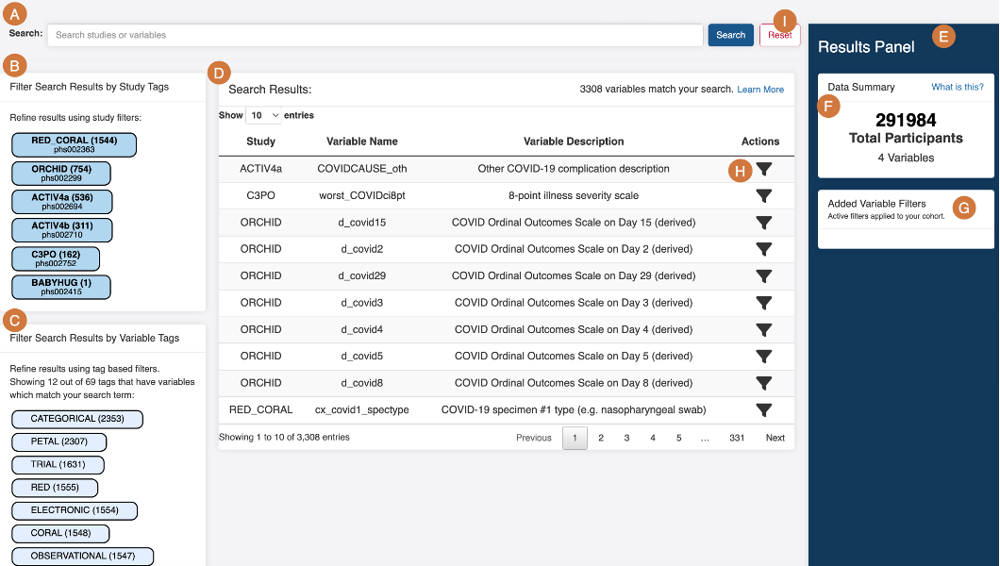

# PIC-SURE Features and General Layout

<figure><figcaption>
General layout of PIC-SURE search
</figcaption></figure>

1. **Search bar**: Enter any phenotypic variable, study or table keyword into the search bar to search across studies. Users can also search specific variables by accession number, if known (phs/pht/phv).
2. **Study Tags**: Users can filter the results found through their search by limiting to studies of interest or excluding studies.
3.  **Variable Tags**: Users can filter the results found through their search by limiting to keywords of interest or excluding keywords that are out of scope. For example, a user could filter to categorical variables, variables containing the term ‘blood’, and/or exclude variables containing the term ‘pressure’.

    _**How are variable tags generated?**_ Each variable has a set of associated tags, which are generated during the PIC-SURE data loading process. These tags are generated based on information associated with the variable, including the name of the study, study description, dataset name, PIC-SURE data type (continuous or categorical), and variable description. For a search in PIC-SURE, tags associated with a variable are displayed. Note that tags applicable to less than 5% or more than 95% of the search results are not displayed since these are not useful for filtering results.
4. **Search Results table**: View all variables associated with your search term and/or study & variable tags.
5. **Results Panel**: Panel with content boxes that describe the cohort based on the variable filters applied to the query.
6. **Data Summary**: Displays the total number of participants in the filtered cohort which meet the query criteria. When first opening the Open or Authorized Access page, the number will be the total number of participants that you can access.
7. **Added Variable Filters summary**: View all filters which have been applied to the cohort.
8. **Filter Action**: Click on the filter icon  to filter cohort participants by specific variable values.
9. **Reset button**: Allows users to start a new search and query by removing all added filters and clearing all active study and variable tags.
