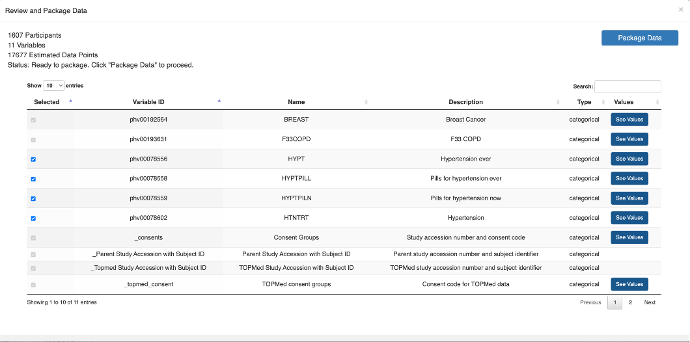

# PIC-SURE Authorized Access

If you are authorized to access any dbGaP dataset(s), the Authorized Access tab at the top will be visible. PIC-SURE Authorized Access provides access to complete, participant-level data, in addition to aggregate counts, and access to the Tool Suite.

<figure><figcaption>
PIC-SURE Authorized Access specific features and layout.
</figcaption></figure>

A. **Select Variables Action**: Click the Select Variables icon to include variables when retrieving data. Users can select variables individually or at the dataset level.

* **Individually select variables**: You can individually select variables from two locations:
  * Variable search results: From the search results you can click the data retrieval icon to include the variable in your data retrieval.
  * Variable modal variable data retrieval: The data retrieval icon next to the variable adds the variable to your data retrieval.
* **Select from a dataset or group of variables**: In the variable modal the data retrieval icon next to the dataset opens a modal to allow you to select variables from the dataset table or group of variables.

B. **Data Summary**: In addition to the total number of participants in the filtered cohort, the number of variables the user has selected for data retrieval is also displayed.

There are four concept paths that are automatically included with any data export from PIC-SURE Authorized Access. These fields are listed and described below.

* _**Patient ID**:_ Internal PIC-SURE participant identifier. Please note that this field is not linking participants between studies and therefore should not be used for data correlation between different data sources or to the original data files.
* _**Parent Study Accession with Subject ID**:_ PIC-SURE generated identifier for parent studies. These identifiers are a combination of the study accession number and the subject identifier.
* _**Topmed Study Accession with Subject ID**:_ PIC-SURE generated identifier for TOPMed studies. These identifiers are a combination of the study accession number and the subject identifier.
* _**Consents**:_ Field used to determine which groups users are authorized to access from dbGaP. These identifiers are a combination of the study accession number and consent code.

C. **Tool Suite**: The Tool Suite contains tools that can be used to further explore filtered cohorts of interest. _Note that at least one filter must be added to the query before using the Tool Suite._

* **Select and Package Data**: Retrieve participant-level data corresponding to your filters and variable selections. Variables selected for data retrieval can be reviewed and modified. To learn more about the options associated with this tool, please refer to the Select and Package Data section.
* **Variable Distributions**: View the distributions of query variables based on the filtered cohort. Note that there is a limit to the number of variable distributions that can be viewed at a given time. Additionally, genomic variables nor variables associated with any-record-of filter (e.g. entire datasets) will not be graphed.

## Select and Package Data

The Select and Package Data tool is used to select and export participant-level data corresponding to your filters and variable selections. There are several options for selecting and exporting the data, which are shown using this tool.

<figure><figcaption>
Select and Package Data tool modal with example filters and variables.
</figcaption></figure>

In the top left corner of the modal, the number of participants and number of variables included in the query is shown. This is used to display the estimated number of data points in the export.

Note: Queries with more than 1,000,000 data points will not be exportable.

The table below displays a summary of the variables included in the export. Using the Selected column, variables that have been added to the export can be selected or deselected for the final dataframe.

Note: Variables with filters are automatically included in the export.

The Package Data button in the top right corner is used to prepare the data for export once the variable filters and selections have been finalized.

<figure><figcaption>
Select and Package Data tool modal with example filters and variables after clicking “Package Data”.
</figcaption></figure>

Once this button is clicked, there are several options to complete the export.

To export into a BDC analysis workspace, the Export to Seven Bridges or Export to Terra buttons can be used. Once clicking either of these buttons, a new modal will be displayed with all information and instuctions needed to complete the export. This includes your personalized access token, the query ID associated with the dataframe. Additionally, there is the option to Copy Query ID without accessing Seven Bridges or Terra if you wish to use a different analysis platform.

The Export to Seven Bridges option includes a Go to Seven Bridges button, which will open a new tab to the Public PIC-SURE API Project on _BDC-Seven Bridges._&#x20;

<figure><figcaption>
Export to Seven Bridges modal.
</figcaption></figure>

The Export to Terra option includes a Go to Terra via R button and a Go to Terra via Python button, which will open the Public PIC-SURE API R Examples workspace and the Public PIC-SURE API Python Examples workspace on _BDC-Terra_, respectively.

<figure><figcaption>
Export to Terra modal.
</figcaption></figure>

## Use Case: Investigating Comorbidities of Breast Cancer in Authorized Access

In this section, the functionalities of PIC-SURE Authorized Access will be described in the context of a scientific use case. Specifically, let’s say I am interested in investigating some comorbidities of breast cancer in women with _BRCA1_ and _BRCA2_ gene variants, such as hypertension and COPD.

I already have been authorized to access the Women’s Health Initiative (WHI) study and am interested in a single cohort: women with breast cancer and variants of the _BRCA1_ and _BRCA2_ genes. I want to select hypertension-related variables of interest, check the distributions of some variables, and export all the data to an analysis workspace.

First, let’s apply our variable filters for the WHI study.

1. Search “breast cancer” in Authorized Access.
2. Add the WHI study tag to filter search results to only age variables found within the WHI study.
3.  Filter to participants with breast cancer by clicking the filter  icon next to the variable of interest. Select values to filter your variable on and click “Add Filter to Query”.

    <figure><figcaption>
Adding a filter to the ‘BREAST’ variable from Women’s Health Initiative Study.
</figcaption></figure>
4. Click the “Genomic Filtering” button to begin a filter on genomic variants.
5.  Select “_BRCA1_” and “_BRCA2_” genes of “High” and “Moderate” severity. Click “Apply genomic filter”.

    <figure><figcaption>
Filter to participants with breast cancer by clicking the filter  icon next to the variable of interest. Select values to filter your variable on and click “Add Filter to Query”.
</figcaption></figure>
6. Now, let’s filter to participants that have and do not have COPD. Similar to before, we will search ‘COPD’. After selecting the variable of interest, we can filter to the desired values before adding the filter to our query. Notice how the total number of participants in our cohort changes.
7. Search “hypertension”.
8.  Add variables to data export by clicking the select variables icon in the Actions column next to the variable of interest. The icon next to variables selected for export will change to the checkmark  icon.

    <figure><figcaption>
Adding a ‘hypertension’ variables (‘HTNTRT’, ‘HYPT’, ‘HYPTPILL’, and ‘HYPTPILN’) for export from Women’s Health Initiative Study.
</figcaption></figure>
9. Notice how the number of variables changed in the Data Summary box.
10. Before we Select and Package the data for export, let’s view the distribution of our participants’ ages to see if we have a normal distribution. Open the Variable Distributions tool in the Tool Suite. Here, we can see the distributions of the two added variable filters: breast cancer (‘BREAST’) and COPD (‘F33COPD’).

    <figure><figcaption>
Variable Distributions modal for the Authorized Access example cohort.
</figcaption></figure>
11. Open the Select and Package Data tool in the Tool Suite. The variables shown in this table are those which will be available in your data export; you can remove variables as necessary.

    <figure><figcaption>
Select and Package Data modal.
</figcaption></figure>
12. Click “Package Data” when you are ready.
13. Once the data is packaged, you can select to either “Export to Seven Bridges” or “Export to Terra”. Copy over the personalized user token and query ID use the PIC-SURE API and export your data to an analysis workspace.
