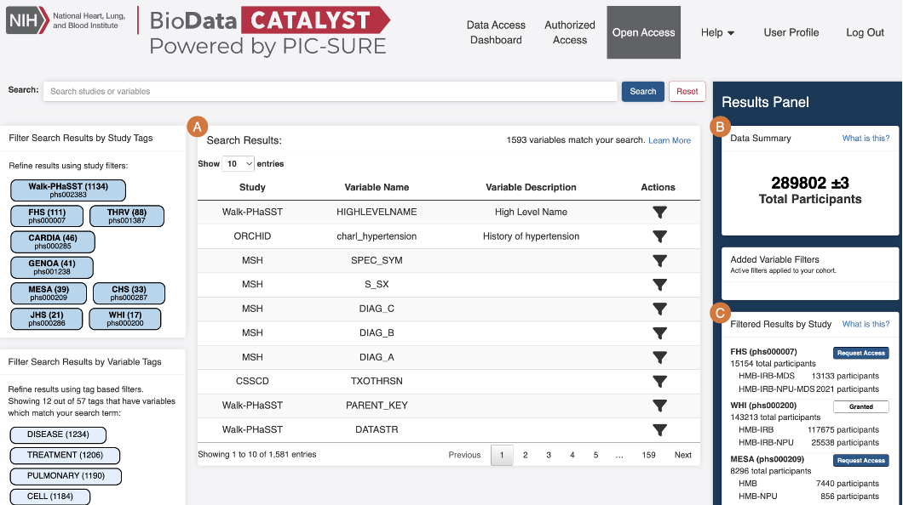
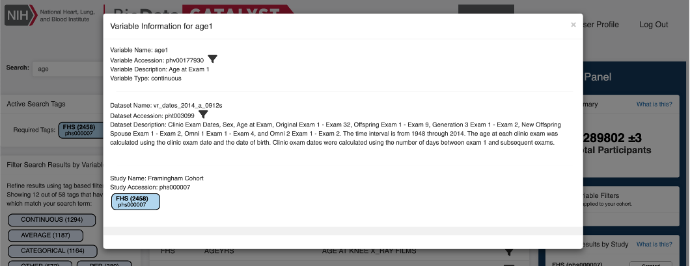
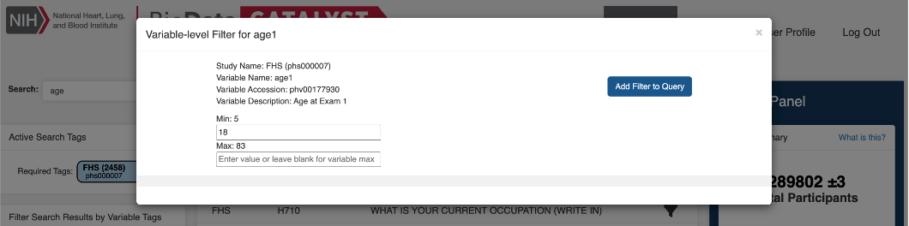
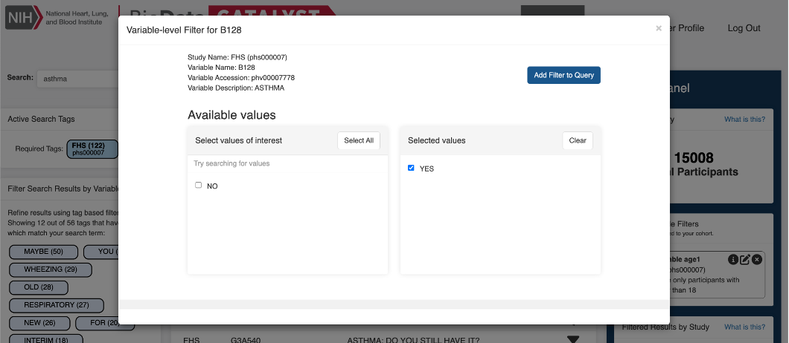

# PIC-SURE Open Access

PIC-SURE Open Access allows you to search any clinical variable available in PIC-SURE. Your queries will return obfuscated aggregate counts per study and consent. There are some features specific to PIC-SURE Open Access, which are outlined below.

<figure><figcaption>
PIC-SURE Open Access specific features and layout.
</figcaption></figure>

A. **Stigmatizing Variables Removal**: PIC-SURE Open Access data excludes clinical variables that contain potentially sensitive information. These variables are known as stigmatizing variables, which fall into the following categories:

* Mental health diagnoses, history, and treatment
* Illicit drug use history
* Sexually transmitted disease diagnoses, history, and treatment
* Sexual history
* Intellectual achievement, ability, and educational attainment
* Direct or surrogate identifiers of legal status

For more information about stigmatizing variables and the identification process, please refer to the documentation and code on the [_BioData Catalyst Powered by PIC-SURE_](https://github.com/hms-dbmi/biodata_catalyst_stigmatizing_variables)[ Stigmatizing Variables GitHub repository](https://github.com/hms-dbmi/biodata_catalyst_stigmatizing_variables).

B. **Data Obfuscation**: Because participant-level data are not available in PIC-SURE Open Access, the aggregate counts are obfuscated to further anonymize the data. This means that:

* If the consent group, study, and/or total participants of the query is between one and nine, the results will be shown as _< 10_.\\
* If the consent group results are between one and nine and the study and/or total participants of the query is greater than 10, the results will be obfuscated by ± 3.
* Query results that are zero participants will display _0_.

C. **View Filtered Results by Study**: The filtered number of participants which match the query criteria is shown broken down by study and consent group. Users can see if they do or do not have access to specific studies.

## Use Case: Using PIC-SURE Open Access to Investigate Asthma in Healthy and Obese Adult Populations 

In this section, the functionalities of PIC-SURE Open Access will be described in the context of a scientific use case. Specifically, let’s say I am interested in investigating asthma in relation to obesity in adults.

I’m interested in two cohorts: obese adults with a body mass index (BMI) greater than 30 and healthy adults with a BMI between 18.5 and 24.9. However, I have not yet submitted a Data Access Request and therefore am not authorized to access any datasets.

First, let’s explore cohort A: Healthy adults with a BMI between 18.5 and 24.9 in Framingham Heart Study (FHS).

1. Search for ‘age’.
2. Apply ‘FHS’ study tag to view only ‘age’ variables within the Framingham Heart Study (phs000007).
3.  Select the variable of interest. You may notice many variables that appear similar. These variables may be located in different datasets, or tables, but contain similar information. Open up the variable information modal by clicking on the row containing the variable of interest to learn more.

    <figure><figcaption>
Variable Information modal for ‘age1’ variable from Framingham Heart Study.
</figcaption></figure>
4.  Filter to adults only by clicking the filter  icon next to the variable. I am interested in adults, so I will set the minimum age to 18, then click “Add filter to query”.

    <figure><figcaption>
Adding a filter to the ‘age1’ variable from Framingham Heart Study.
</figcaption></figure>
5. Now, let’s filter to healthy adults with a BMI between 18.5 and 24.9. Similar to before, we will search ‘BMI’. We can narrow down the search results using the variable-level tags by including terms related to our variable of interest (such as ‘continuous’ to view only continuous variables) and excluding out-of-scope terms (such as ‘allergy’). After selecting the variable of interest, we can filter to the desired ranges before adding the filter to our query. Notice how the total number of participants in our cohort changes.
6.  Finally, we will filter for participants who have asthma.

    <figure><figcaption>
Adding a filter to the ‘B128’ variable from Framingham Heart Study.
</figcaption></figure>
7. Note the total participant count in the Data Summary.

We can easily modify our filters to explore cohort B: Obese adults with a body mass index (BMI) greater than 30 in Framingham Heart Study.

1. Edit the BMI filter by clicking the edit icon in the Added Variable Filters section. Change the range to have a minimum of 30 and no maximum.
2. Note the total participant count in the Data Summary.

We can easily repeat these steps for other studies, such as the Genetic Epidemiology of COPD (COPDGene) study, and create a table like the one below. By comparing these two studies, I can see that COPDGene may be more promising for my research since it contains many more participants in my cohorts of interest than FHS does.

| Framingham Heart Study (FHS)            | 50 +/- 3  | 72 +/- 3 |
| --------------------------------------- | --------- | -------- |
| Genetic Epidemiology of COPD (COPDGene) | 488 +/- 3 | 868      |

&#x20;

I can then use the Request Access button to go directly to the study’s dbGaP page and begin submitting a DAR.\
