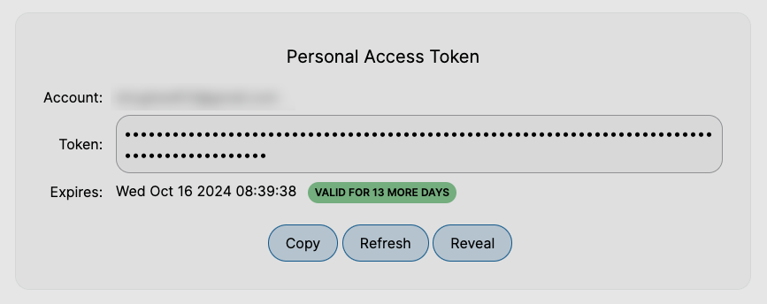

# PIC-SURE Personal Access Token

## PIC-SURE Personal Access Token

To access the PIC-SURE API, a user-specific token is needed. This is the way the API grants individual users access to participant-level protected-access data. The user token is strictly personal; do not share it with anyone.

You can copy your personalized access token by selecting the **Prepare for Analysis** tab at the top of the screen.

<figure><figcaption>
Personalized Access Token displayed in the Prepare for Analysis tab.
</figcaption></figure>

Here, you can **Copy** your personalized access token, **Reveal** your token, and **Refresh** your token to retrieve a new token and deactivate the old token.
